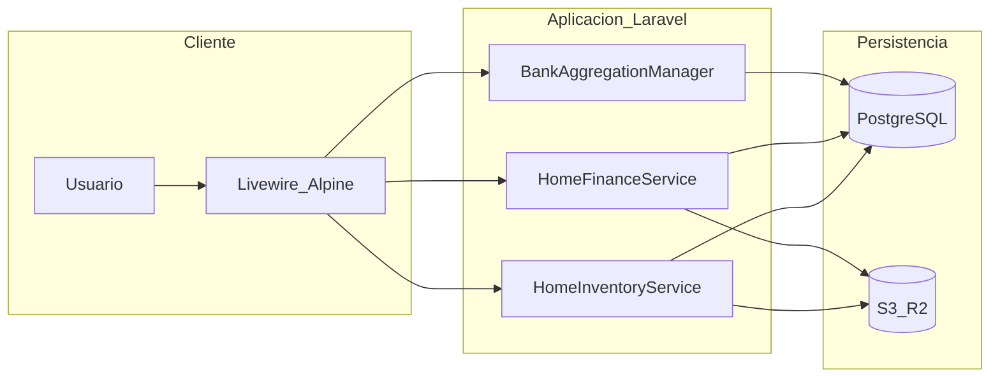
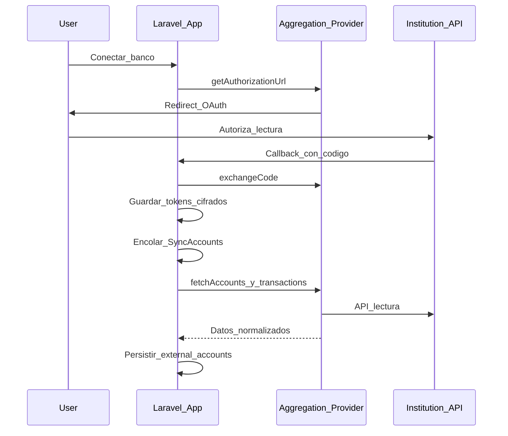

# Especificación y hoja de ruta — Módulo Hogar (Home Management)

| Campo | Valor |
| --- | --- |
| Versión del documento | 1.0 |
| Fecha | 2026-05-14 |
| Estado | Aprobado para implementación |
| Stack de referencia | Laravel 13, PHP 8.3, Livewire 4, Alpine.js 3, Tailwind 3, Chart.js 4, PostgreSQL, S3 (Flysystem), Spatie Laravel Permission, DomPDF |

---

## Tabla de contenidos

1. [Resumen ejecutivo](#1-resumen-ejecutivo)
2. [Contexto del producto y arquitectura actual](#2-contexto-del-producto-y-arquitectura-actual)
3. [Objetivos y alcance](#3-objetivos-y-alcance)
4. [Fuera de alcance (v1)](#4-fuera-de-alcance-v1)
5. [Actores, permisos y módulo de plan](#5-actores-permisos-y-módulo-de-plan)
6. [Requisitos funcionales](#6-requisitos-funcionales)
7. [Requisitos no funcionales](#7-requisitos-no-funcionales)
8. [Modelo de datos](#8-modelo-de-datos)
9. [Open Banking y agregación bancaria (v1)](#9-open-banking-y-agregación-bancaria-v1)
10. [Inteligencia artificial y visión (Gemini)](#10-inteligencia-artificial-y-visión-gemini)
11. [Códigos de barras y escaneo](#11-códigos-de-barras-y-escaneo)
12. [Rutas, vistas y componentes Livewire](#12-rutas-vistas-y-componentes-livewire)
13. [Servicios de dominio](#13-servicios-de-dominio)
14. [Diagramas](#14-diagramas)
15. [Fases de implementación, entregables y criterios de aceptación](#15-fases-de-implementación-entregables-y-criterios-de-aceptación)
16. [Cronograma orientativo](#16-cronograma-orientativo)
17. [Pruebas y calidad](#17-pruebas-y-calidad)
18. [Observabilidad y operación](#18-observabilidad-y-operación)
19. [Riesgos y mitigaciones](#19-riesgos-y-mitigaciones)
20. [Decisión pendiente: proveedor Open Banking](#20-decisión-pendiente-proveedor-open-banking)
21. [Referencias en el repositorio](#21-referencias-en-el-repositorio)

---

## 1. Resumen ejecutivo

El **Módulo Hogar** extiende el sistema SaaS multi-tenant existente con un dominio independiente del catálogo comercial de ventas: **inventario del hogar**, **lista de mercado** con sugerencia de compras según stock objetivo, **finanzas del hogar** (servicios, facturas, transacciones, comprobantes), **agregación bancaria (Open Banking) en v1** para consultar saldos y movimientos de gasto, y **mecanismos de bajo fricción para descontar stock** (escaneo de código de barras y reconocimiento por imagen con confirmación del usuario).

El documento define requisitos trazables, modelo de datos, capas técnicas, orden de implementación y criterios de aceptación para una solución **escalable** (colas, proveedor bancario intercambiable, límites de API de IA) y **auditable**.

---

## 2. Contexto del producto y arquitectura actual

- **Backend**: Laravel 13 (`composer.json`).
- **UI**: vistas bajo convención `admin.v2.*`, rutas con prefijo `admin.*` y middleware `auth` + `can:*` (`routes/web.php`).
- **Módulos de plan**: definidos en [`config/plan_modules.php`](config/plan_modules.php); el registro en tiempo de ejecución usa [`app/Support/ModuleRegistry.php`](app/Support/ModuleRegistry.php) (`config('plan_modules.modules')`).
- **IA existente**: [`app/Services/GeminiOcrService.php`](app/Services/GeminiOcrService.php) implementa hoy **`extractNumber`** (OCR de precio en imagen base64). Para el hogar se requerirán **métodos adicionales** o un servicio colateral (p. ej. identificación de producto, extracción estructurada de factura) sin romper el contrato actual del escáner de precios.
- **Gráficos**: Chart.js ya en el front (`package.json`).
- **Almacenamiento de archivos**: `league/flysystem-aws-s3-v3` para fotos de productos, facturas y comprobantes.

---

## 3. Objetivos y alcance

| ID | Objetivo |
| --- | --- |
| O1 | Registrar productos del hogar (nombre, marca, categoría, unidad, cantidades, precio de referencia, código de barras, imagen). |
| O2 | Calcular **cantidad a comprar** para alcanzar el **stock objetivo** (`min_quantity`): `to_buy = max(0, min_quantity - quantity)`. |
| O3 | Generar y gestionar **listas de mercado** (incl. vista móvil en supermercado, exportación/imprimir PDF). |
| O4 | Gestionar **servicios del hogar** y **facturas** con montos, fechas de vencimiento, corte, pago y adjunto de imagen/PDF. |
| O5 | Registrar **transacciones** (ingreso/gasto), categorías, comprobantes y vínculo opcional a cuenta. |
| O6 | **Open Banking v1**: conectar instituciones vía agregador, sincronizar cuentas y transacciones en solo lectura, mostrar saldo cacheado y movimientos. |
| O7 | **Descontar inventario** por escaneo de código de barras o por foto con matching asistido por IA, siempre con **confirmación** y registro de movimiento. |
| O8 | **Dashboard del hogar** con KPIs, próximos vencimientos y accesos rápidos a escáner y lista activa. |

---

## 4. Fuera de alcance (v1)

- Ejecución de **pagos** o transferencias desde la aplicación (solo lectura y registro manual de pagos de servicios).
- **Reconciliación bancaria automática** completa entre movimiento externo y transacción interna (puede quedar como mejora; v1: visualización y filtros).
- **PWA offline** completa (la lista móvil puede optimizarse para carga ligera; sincronización offline es mejora futura).
- Garantía de reconocimiento de producto **sin confirmación humana** cuando la confianza del modelo sea baja.

---

## 5. Actores, permisos y módulo de plan

### 5.1 Actores

- **Usuario tenant**: empleado o titular con permisos granulares.
- **Administrador de empresa**: asigna roles y acceso al módulo según plan.

### 5.2 Permisos Spatie (propuesta)

| Permiso | Descripción |
| --- | --- |
| `home.inventory.index` … `destroy` | CRUD inventario productos hogar |
| `home.finances.*` | Servicios, facturas, transacciones, cuentas manuales |
| `home.shopping_list.*` | Generar y gestionar listas de mercado |
| `home.scan_deduct` | Uso de escáner barcode/foto para descuento |
| `home.bank.connect` | Iniciar OAuth / vincular institución |
| `home.bank.view` | Ver cuentas y transacciones sincronizadas |

### 5.2 Entrada en `plan_modules`

Añadir en [`config/plan_modules.php`](config/plan_modules.php) bajo `modules`:

```php
'home' => [
    'label' => 'Módulo Hogar',
    'permission_prefixes' => ['home'],
    'limit_relation' => null,
    'super_admin_only' => false,
    'platform_console_only' => false,
    'in_plan_form' => true,
],
```

### 5.3 Navegación

Ítem de menú colapsable **Hogar** con subrutas: Dashboard, Inventario, Lista de mercado, Finanzas, Conexiones bancarias, Escaner (descuento).

---

## 6. Requisitos funcionales

### 6.1 Inventario (INV)

| RF | Descripción | Prioridad |
| --- | --- | --- |
| INV-01 | CRUD de productos del hogar por `company_id` (tenant). | Alta |
| INV-02 | Campos: nombre, marca, categoría, `quantity`, `min_quantity` (stock objetivo), `max_quantity` (opcional, excedente), `unit`, `purchase_price`, `barcode` (nullable), imagen principal. | Alta |
| INV-03 | Listado con búsqueda, filtro por categoría, badge de estado: bajo stock (`quantity < min_quantity`), ok, excedente (`max_quantity` y `quantity > max_quantity`). | Alta |
| INV-04 | Historial de movimientos: tipos `in`, `out`, `photo_deduct`, `barcode_deduct`, con cantidad, notas, usuario, timestamp. | Alta |
| INV-05 | **Entrada rápida** post-mercado: registrar compra (producto + cantidad + precio opcional) en un solo flujo. | Media |
| INV-06 | Subida de imágenes a disco configurado (S3). | Alta |

### 6.2 Lista de mercado (SHP)

| RF | Descripción | Prioridad |
| --- | --- | --- |
| SHP-01 | Generar lista a partir de productos con `to_buy > 0`. | Alta |
| SHP-02 | Mostrar: producto, cantidad actual, `min_quantity`, `to_buy`, precio estimado (`to_buy * purchase_price`). | Alta |
| SHP-03 | Marcar ítems comprados, editar cantidad sugerida, añadir ítems ad hoc no catalogados. | Media |
| SHP-04 | Completar lista y archivar. | Media |
| SHP-05 | Exportar PDF (DomPDF) y vista imprimible. | Media |
| SHP-06 | Vista **mobile-first** para uso en supermercado (checkboxes grandes, columnas mínimas). Criterio de implementación: **Livewire con wire:loading mínimo** o página **Blade + Alpine** para primera pintura rápida en redes débiles; documentar la elección en ADR breve en comentario de PR. | Media |

### 6.3 Finanzas hogar (FIN)

| RF | Descripción | Prioridad |
| --- | --- | --- |
| FIN-01 | CRUD servicios (agua, luz, internet, gas, etc.): proveedor, número de contrato. | Alta |
| FIN-02 | CRUD facturas de servicio: período, monto, `due_date`, `cutoff_date`, `paid_at`, imagen adjunta. | Alta |
| FIN-03 | Alertas de próximos vencimientos (configurable, p. ej. 7 y 3 días antes). | Media |
| FIN-04 | Transacciones manuales: tipo ingreso/gasto, categoría, monto, fecha, descripción, comprobante, cuenta manual opcional. | Alta |
| FIN-05 | Dashboard: donut por categoría, línea ingresos vs gastos, tarjetas de resumen, tabla de próximos vencimientos. | Alta |
| FIN-06 | OCR asistido (Gemini) para sugerir monto/fecha al subir imagen de factura, con edición manual obligatoria antes de guardar si el usuario no confía en el resultado. | Baja |

### 6.4 Bancos y Open Banking (BNK)

| RF | Descripción | Prioridad |
| --- | --- | --- |
| BNK-01 | Flujo OAuth (o equivalente del proveedor) para vincular institución. | Alta |
| BNK-02 | Almacenar tokens de acceso de forma cifrada; refresco automático según documentación del agregador. | Alta |
| BNK-03 | Sincronizar cuentas y transacciones (job en cola + acción manual “Sincronizar ahora”). | Alta |
| BNK-04 | UI: listado de conexiones, estado, última sync, cuentas con saldo cacheado y listado de movimientos filtrable por fecha. | Alta |
| BNK-05 | Cuentas **manuales** (`home_bank_accounts`) coexisten como fuente no conectada para saldos editados a mano y transacciones internas. | Media |

### 6.5 Escaneo y descuento (SCN)

| RF | Descripción | Prioridad |
| --- | --- | --- |
| SCN-01 | Escaneo en navegador: **Barcode Detection API** cuando exista; fallback documentado (p. ej. librería JS ZXing o envío de frame a Gemini solo para decodificar código). | Alta |
| SCN-02 | Match de código con `home_products.barcode` por `company_id`; confirmación antes de descontar. | Alta |
| SCN-03 | Foto de producto: envío a servicio de identificación; matching por similitud de nombre/marca contra inventario; umbral de confianza; selección manual si hay ambigüedad. | Alta |
| SCN-04 | No permitir stock negativo; mensaje claro si `quantity < deduct`. | Alta |
| SCN-05 | Toast con acción **Deshacer** (ventana corta, p. ej. 5 s) que revierta movimiento y stock. | Media |

---

## 7. Requisitos no funcionales

| NFR | Descripción |
| --- | --- |
| Seguridad | Tokens OAuth y datos sensibles cifrados (`Illuminate\Support\Facades\Crypt` o casts `encrypted`); acceso a rutas bajo `auth` + `can`; URLs de objetos S3 con política de acceso acotada o URLs firmadas. |
| Multi-tenant | Todas las tablas con `company_id` y scopes en modelos/Eloquent global scope según patrón existente del proyecto. |
| Rendimiento | Índices en `company_id`, `barcode`+`company_id`, fechas de facturas y transacciones; paginación en listados; jobs para sync bancaria y llamadas Gemini pesadas. |
| Auditoría | Tabla de movimientos de inventario inmutable (no editar cantidades a posteriori salvo reversión explícita); log de conexiones bancarias y errores de sync. |
| i18n / moneda | `currency_code` ISO 4217 en cuentas; formateo consistente con locale de la app. |
| Coste IA | Límites por usuario/día o por empresa (configurable); degradación elegante si API no disponible. |
| Cumplimiento | Solo scopes de **lectura** del agregador; política de retención de transacciones externas alineada a proveedor y ley local; minimizar PII en logs. |

---

## 8. Modelo de datos

### 8.1 Inventario y listas

**`home_products`**

- `id`, `company_id`
- `name`, `brand` (nullable), `category` (string o FK a `home_product_categories` si se normaliza)
- `quantity` (decimal si se soportan medias unidades; entero si no)
- `min_quantity`, `max_quantity` (nullable)
- `unit` (enum/string: unidad, kg, l, g, ml, paquete, etc.)
- `purchase_price` (decimal)
- `barcode` (nullable, **único compuesto** con `company_id`)
- `image_path` o `image` (string, path en bucket)
- `created_at`, `updated_at`, `deleted_at` (opcional soft delete)

**`home_product_images`** (opcional, múltiples fotos por producto)

- `id`, `home_product_id`, `path`, `created_at`

**`home_product_movements`**

- `id`, `company_id`, `home_product_id`, `user_id` (nullable)
- `type`: `in` | `out` | `photo_deduct` | `barcode_deduct`
- `quantity`, `notes` (nullable), `metadata` (json nullable: id gemini, código leído, etc.)
- `created_at`

**`home_shopping_lists`**

- `id`, `company_id`, `generated_at`, `is_completed`, `created_at`, `updated_at`

**`home_shopping_list_items`**

- `id`, `home_shopping_list_id`, `home_product_id` (nullable si ad hoc)
- `name_snapshot` (para ítems sin producto), `suggested_quantity`, `actual_purchased_quantity`, `is_purchased`, `notes`

### 8.2 Finanzas manuales

**`home_services`**: `company_id`, `name`, `provider`, `contract_number`, timestamps.

**`home_service_bills`**: `home_service_id`, `period` (YYYY-MM), `amount`, `due_date`, `cutoff_date`, `paid_at`, `bill_image_path`, `ocr_status`, `ocr_payload` (json acotado, nullable), `notes`, timestamps.

**`home_bank_accounts`** (cuentas manuales / no conectadas)

- `company_id`, `bank_name`, `account_type`, `account_number_encrypted` o masked display + encrypted
- `balance`, `currency_code`, timestamps

**`home_transactions`**

- `company_id`, `home_bank_account_id` (nullable), `type` income/expense, `category`, `amount`, `description`, `transaction_date`, `receipt_image_path`, timestamps

### 8.3 Open Banking (agregación)

**`home_bank_connections`**

- `id`, `company_id`, `user_id` (quien conectó)
- `provider` (string enum: `belvo`, `klavi`, `tink`, etc.)
- `external_link_id` o id de usuario en agregador
- `access_token_encrypted`, `refresh_token_encrypted` (según proveedor)
- `token_expires_at`, `status` (active, error, revoked)
- `last_successful_sync_at`, `last_error_message` (nullable, truncado)
- timestamps

**`home_external_accounts`**

- `id`, `company_id`, `home_bank_connection_id`
- `external_account_id` (único con connection)
- `institution_name`, `masked_number`, `currency_code`, `balance_cached`, `last_synced_at`
- timestamps

**`home_external_transactions`**

- `id`, `company_id`, `home_external_account_id`
- `external_transaction_id` (único por cuenta externa)
- `amount`, `currency_code`, `posted_at`, `description`, `raw_category` (nullable)
- timestamps

**Decisión de modelo unificado**: las cuentas **manuales** y las **externas** se muestran en UI en secciones distintas o pestañas; opcionalmente una vista SQL o DTO “`HomeAccountView`” unifica presentación sin mezclar PKs.

---

## 9. Open Banking y agregación bancaria (v1)

### 9.1 Capa proveedor-agnóstica

Definir interfaz PHP, por ejemplo:

- `BankAggregationProvider::getAuthorizationUrl(Company $company, string $redirectUri): string`
- `BankAggregationProvider::handleCallback(Request $request): BankConnectionResult`
- `BankAggregationProvider::refreshConnection(HomeBankConnection $connection): void`
- `BankAggregationProvider::syncAccounts(HomeBankConnection $connection): void`
- `BankAggregationProvider::syncTransactions(HomeExternalAccount $account, ?Carbon $since): void`

Implementación **concreta v1** en clase `BelvoBankProvider` (o la que resulte del checklist del §20), inyectada vía `config('services.bank_aggregation.driver')`.

### 9.2 Flujos

1. Usuario con permiso `home.bank.connect` inicia conexión → redirect OAuth del agregador.
2. Callback controlado (CSRF state, validación `company_id`) → intercambio de código por tokens → persistencia cifrada → job `SyncBankAccountsJob`.
3. Job encadenado o programado: `SyncBankTransactionsJob` por cuenta con ventana incremental (`since` última transacción conocida).
4. Webhooks del proveedor (si existen): endpoint `POST /webhooks/bank/{provider}` verificado por firma; encolar sync.

### 9.3 Seguridad

- Nunca registrar `access_token` en logs.
- Rotación de `APP_KEY` debe documentarse (re-cifrado manual o comando artisan futuro).
- Revocación: botón “Desconectar” que llama API del proveedor y marca `status=revoked` y borra tokens.

---

## 10. Inteligencia artificial y visión (Gemini)

- **Estado actual**: `GeminiOcrService::extractNumber` — modelo configurable en `config('services.gemini.model')`, timeout 10s, temperatura 0.
- **Extensiones recomendadas** (mismo servicio o clase `GeminiHouseholdVisionService`):
  - `identifyProductFromImage(string $base64, string $mimeType): ProductIdentificationResult` (nombre, marca, lista de candidatos, `confidence` 0–1).
  - `extractInvoiceFields(string $base64, string $mimeType): InvoiceSuggestion` (monto, fecha vencimiento, proveedor sugerido) — salida JSON validada.
- **Política**: si `confidence < umbral` (p. ej. 0.75), no preseleccionar deducción automática; forzar selector de producto.
- **Coste y fiabilidad**: reutilizar `Http::timeout`; considerar cola para no bloquear request web en subidas grandes.

---

## 11. Códigos de barras y escaneo

- **Primario**: [Barcode Detection API](https://developer.mozilla.org/en-US/docs/Web/API/Barcode_Detection_API) en Chromium.
- **Fallback**: librería JS en bundle Vite (p. ej. `@zxing/browser`) o segunda llamada Gemini con prompt “devuelve solo el código de barras numérico”.
- **Servidor**: `HomeBarcodeService` resuelve match y delega en `HomeInventoryService::deduct`.

---

## 12. Rutas, vistas y componentes Livewire

Convención alineada al proyecto: vistas `resources/views/admin/v2/home/...`, nombres de ruta `admin.home.*`.

| Ruta (HTTP GET salvo anotación) | Nombre | Vista / componente |
| --- | --- | --- |
| `/home` | `admin.home.index` | `admin.v2.home.index` + `HomeDashboard` |
| `/home/inventory` | `admin.home.inventory.index` | `HomeProductsIndex` |
| `/home/inventory/create` | `admin.home.inventory.create` | `HomeProductForm` |
| `/home/inventory/{id}/edit` | `admin.home.inventory.edit` | `HomeProductForm` |
| `/home/shopping-list` | `admin.home.shopping-list.index` | `HomeShoppingListIndex` |
| `/home/shopping-list/mobile` | `admin.home.shopping-list.mobile` | Vista mobile |
| `/home/finances` | `admin.home.finances.dashboard` | `HomeFinancesDashboard` |
| `/home/finances/services` | `admin.home.finances.services` | `HomeServicesIndex` |
| `/home/finances/bills` | `admin.home.finances.bills` | `HomeServiceBillsIndex` |
| `/home/finances/transactions` | `admin.home.finances.transactions` | `HomeTransactionsIndex` |
| `/home/finances/accounts` | `admin.home.finances.accounts` | Cuentas manuales |
| `/home/bank` | `admin.home.bank.index` | Conexiones y cuentas externas |
| `/home/bank/connect` | `admin.home.bank.connect` | Inicio OAuth |
| `GET/POST` callback agregador | `admin.home.bank.callback` | Controller fino, sin vista |
| `/home/scan` | `admin.home.scan.index` | `HomeScanIndex` |

Middleware: `auth`, `can:` según permisos anteriores; feature flag opcional por plan vía `ModuleRegistry` / middleware de módulo activo.

---

## 13. Servicios de dominio

| Servicio | Responsabilidad |
| --- | --- |
| `App\Services\Home\HomeInventoryService` | Stock, `to_buy`, movimientos, deducción con transacción DB, reversión “deshacer”. |
| `App\Services\Home\HomeShoppingListService` | Generación de lista, totales estimados, completar lista. |
| `App\Services\Home\HomeFinanceService` | Agregados, próximos vencimientos, datos para Chart.js. |
| `App\Services\Home\HomeBarcodeService` | Resolución barcode → producto. |
| `App\Services\Home\HomeVisionService` | Orquestación identify + match contra catálogo hogar. |
| `App\Services\Home\Bank\BankAggregationManager` | Resuelve proveedor y opera sync. |

---

## 14. Diagramas

### 14.1 Flujo principal (aplicación)



### 14.2 Open Banking



---

## 15. Fases de implementación, entregables y criterios de aceptación

### Fase 0 — Fundaciones

**Entregables**: migraciones §8, permisos Spatie, entrada `home` en `plan_modules`, rutas esqueleto, ítem sidebar, policies mínimas.

**Criterios de aceptación**

- Un usuario con permiso ve el menú Hogar; sin permiso recibe 403.
- Migraciones ejecutan en entorno limpio sin conflicto con tablas existentes.

### Fase 1 — Inventario

**Entregables**: CRUD Livewire, subida imagen, movimientos manuales in/out, entrada rápida.

**Criterios de aceptación**

- INV-01 a INV-04, INV-06 cumplidos en pruebas manuales y tests unitarios de stock.

### Fase 2 — Lista de mercado

**Entregables**: generación desde `to_buy`, PDF, vista mobile.

**Criterios de aceptación**

- SHP-01 a SHP-05; lista reproducible con datos semilla.

### Fase 3 — Finanzas manuales

**Entregables**: servicios, facturas, transacciones, cuentas manuales, dashboard Chart.js.

**Criterios de aceptación**

- FIN-01 a FIN-05; gráficos con datos de al menos un mes simulado.

### Fase 4 — Open Banking

**Entregables**: interfaz proveedor, OAuth, tablas conexión/externas, jobs sync, UI cuentas y movimientos.

**Criterios de aceptación**

- BNK-01 a BNK-04 en sandbox del proveedor elegido; desconexión borra tokens de aplicación.

### Fase 5 — Escáner barcode

**Entregables**: `HomeScanIndex`, integración cámara, confirmación, movimiento `barcode_deduct`.

**Criterios de aceptación**

- SCN-01 (Chromium), SCN-02, SCN-04; fallback documentado en README interno del módulo.

### Fase 6 — Foto y Gemini

**Entregables**: `identifyProductFromImage`, matching, `photo_deduct`, deshacer.

**Criterios de aceptación**

- SCN-03, SCN-05; test con mock HTTP de Gemini.

### Fase 7 — Dashboard hogar y pulido UX

**Entregables**: `HomeDashboard` con KPIs, enlaces rápidos, timeline movimientos.

**Criterios de aceptación**

- O8 verificado en dispositivo móvil y escritorio.

### Fase 8 — Hardening

**Entregables**: índices, límites IA, logs, cobertura de tests críticos, documentación `.env.example` (claves Gemini + agregador).

**Criterios de aceptación**

- Suite CI verde; revisión de seguridad en tokens y S3.

---

## 16. Cronograma orientativo

| Fase | Días hábiles (estimado) |
| --- | --- |
| Fase 0 | 1–2 |
| Fase 1 | 2–4 |
| Fase 2 | 2 |
| Fase 3 | 3–4 |
| Fase 4 | 5–10 (depende fuertemente del proveedor y sandbox) |
| Fase 5 | 2–3 |
| Fase 6 | 2–4 |
| Fase 7 | 1–2 |
| Fase 8 | 2–3 |

**Total orientativo**: 20–34 días hábiles, siendo Fase 4 el mayor riesgo de calendario.

---

## 17. Pruebas y calidad

- **Unitarias**: `HomeInventoryService` (cálculo `to_buy`, no negativo, reversión), `HomeFinanceService` (agregados por mes).
- **Feature / HTTP**: OAuth callback con proveedor mockeado; creación de lista.
- **Livewire**: componentes de formulario con `Livewire::test` donde aplique.
- **Factories** para `HomeProduct`, `HomeBankConnection`, etc.

---

## 18. Observabilidad y operación

- Logs estructurados: `home.bank.sync`, `home.gemini.identify`, correlación `company_id`.
- Métricas opcionales: contador de fallos sync, latencia Gemini.
- Colas: `sync-bank`, `gemini-heavy` con timeouts y reintentos con backoff.

---

## 19. Riesgos y mitigaciones

| Riesgo | Mitigación |
| --- | --- |
| BarcodeDetector no disponible en Safari/Firefox | Fallback ZXing o Gemini en documentación y código. |
| Proveedor bancario cambia API | Capa `BankAggregationProvider` + tests de contrato sobre DTOs internos. |
| Alucinaciones / error de IA | Confirmación obligatoria; umbral de confianza; no deducir sin match. |
| Coste Gemini | Cuotas por empresa, modelo `flash`, caché de resultado por hash de imagen (opcional, con TTL corto). |
| Datos sensibles en facturas | Almacenamiento en bucket privado; URLs firmadas; minimizar `ocr_payload`. |

---

## 20. Decisión pendiente: proveedor Open Banking

Antes de implementar Fase 4, completar checklist:

- [ ] País(es) de operación de los usuarios finales del tenant.
- [ ] Cobertura institucional del agregador en esos países.
- [ ] Contrato comercial, límites de API y coste por conexión/sync.
- [ ] Sandbox disponible y documentación de OAuth (scopes solo lectura).
- [ ] Requisitos legales (consentimiento del usuario, textos en UI, retención de datos).
- [ ] Webhooks vs polling exclusivo.

**Nota**: La interfaz `BankAggregationProvider` permite cambiar de proveedor sin reescribir la UI del módulo Hogar.

---

## 21. Referencias en el repositorio

| Recurso | Ruta |
| --- | --- |
| Dependencias PHP | `composer.json` |
| Dependencias JS | `package.json` |
| Módulos de plan | `config/plan_modules.php` |
| Registro de módulos | `app/Support/ModuleRegistry.php` |
| OCR Gemini actual | `app/Services/GeminiOcrService.php` |
| Ejemplo HTTP + Gemini | `app/Http/Controllers/ScannerController.php` |
| Rutas admin | `routes/web.php` |

---

*Fin del documento. Cualquier cambio de alcance debe actualizar la versión y la tabla de requisitos.*
