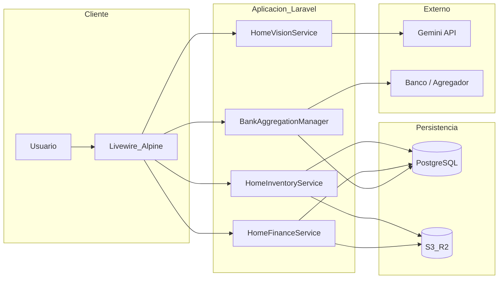
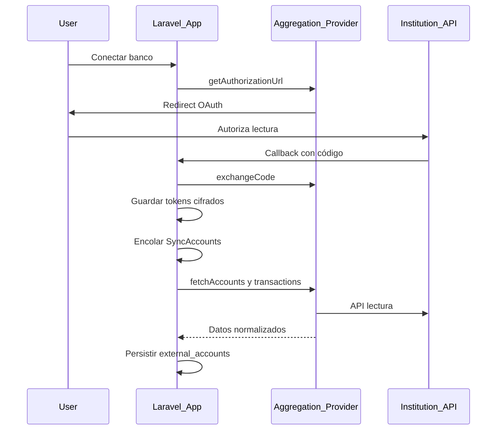
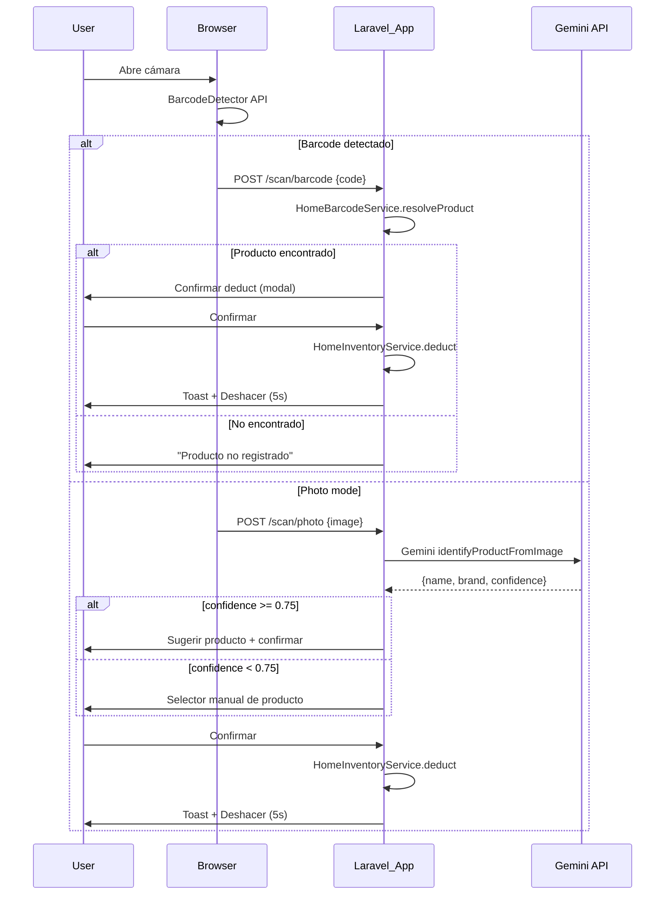

# Especificación y hoja de ruta — Módulo Hogar (Home Management)

| Campo | Valor |
| --- | --- |
| Versión del documento | 2.0 |
| Fecha | 2026-05-15 |
| Estado | Aprobado para implementación |
| Stack de referencia | Laravel 13, PHP 8.3, Livewire 4, Alpine.js 3, Tailwind 3, Chart.js 4, PostgreSQL, S3 (Flysystem), Spatie Laravel Permission, DomPDF |

---

## Tabla de contenidos

1. [Resumen ejecutivo](#1-resumen-ejecutivo)
2. [Contexto del producto y arquitectura actual](#2-contexto-del-producto-y-arquitectura-actual)
3. [Objetivos y alcance](#3-objetivos-y-alcance)
4. [Fuera de alcance (v1)](#4-fuera-de-alcance-v1)
5. [Actores, permisos y módulo de plan](#5-actores-permisos-y-módulo-de-plan)
6. [Requisitos funcionales](#6-requisitos-funcionales)
7. [Requisitos no funcionales](#7-requisitos-no-funcionales)
8. [Modelo de datos](#8-modelo-de-datos)
9. [Modelos Eloquent](#9-modelos-eloquent)
10. [Policies](#10-policies)
11. [Form Requests / Validación](#11-form-requests--validación)
12. [Eventos y Listeners](#12-eventos-y-listeners)
13. [Jobs de Queue](#13-jobs-de-queue)
14. [Open Banking y agregación bancaria (v1)](#14-open-banking-y-agregación-bancaria-v1)
15. [Inteligencia artificial y visión (Gemini)](#15-inteligencia-artificial-y-visión-gemini)
16. [Códigos de barras y escaneo](#16-códigos-de-barras-y-escaneo)
17. [Rutas, vistas y componentes Livewire](#17-rutas-vistas-y-componentes-livewire)
18. [Estructura de archivos Blade](#18-estructura-de-archivos-blade)
19. [Servicios de dominio](#19-servicios-de-dominio)
20. [Diagramas](#20-diagramas)
21. [Configuración y variables de entorno](#21-configuración-y-variables-de-entorno)
22. [Almacenamiento S3 — estructura de carpetas](#22-almacenamiento-s3--estructura-de-carpetas)
23. [Categorías de productos del hogar](#23-categorías-de-productos-del-hogar)
24. [Responsive design y accesibilidad](#24-responsive-design-y-accesibilidad)
25. [Fases de implementación, entregables y criterios de aceptación](#25-fases-de-implementación-entregables-y-criterios-de-aceptación)
26. [Cronograma orientativo](#26-cronograma-orientativo)
27. [Pruebas y calidad](#27-pruebas-y-calidad)
28. [Observabilidad y operación](#28-observabilidad-y-operación)
29. [Riesgos y mitigaciones](#29-riesgos-y-mitigaciones)
30. [Decisión pendiente: proveedor Open Banking](#30-decisión-pendiente-proveedor-open-banking)
31. [Edge cases documentados](#31-edge-cases-documentados)
32. [Referencias en el repositorio](#32-referencias-en-el-repositorio)

---

## 1. Resumen ejecutivo

El **Módulo Hogar** extiende el sistema SaaS multi-tenant existente con un dominio independiente del catálogo comercial de ventas: **inventario del hogar**, **lista de mercado** con sugerencia de compras según stock objetivo, **finanzas del hogar** (servicios, facturas, transacciones, comprobantes), **agregación bancaria (Open Banking) en v1** para consultar saldos y movimientos de gasto, y **mecanismos de bajo fricción para descontar stock** (escaneo de código de barras y reconocimiento por imagen con confirmación del usuario).

El documento define requisitos trazables, modelo de datos, capas técnicas, orden de implementación y criterios de aceptación para una solución **escalable** (colas, proveedor bancario intercambiable, límites de API de IA) y **auditable**.

---

## 2. Contexto del producto y arquitectura actual

- **Backend**: Laravel 13 (`composer.json`).
- **UI**: vistas bajo convención `admin.v2.*`, rutas con prefijo `admin.*` y middleware `auth` + `can:*` (`routes/web.php`).
- **Módulos de plan**: definidos en [`config/plan_modules.php`](config/plan_modules.php); el registro en tiempo de ejecución usa [`app/Support/ModuleRegistry.php`](app/Support/ModuleRegistry.php) (`config('plan_modules.modules')`).
- **IA existente**: [`app/Services/GeminiOcrService.php`](app/Services/GeminiOcrService.php) implementa hoy **`extractNumber`** (OCR de precio en imagen base64). Para el hogar se requerirán **métodos adicionales** o un servicio colateral (p. ej. identificación de producto, extracción estructurada de factura) sin romper el contrato actual del escáner de precios.
- **Gráficos**: Chart.js ya en el front (`package.json`).
- **Almacenamiento de archivos**: `league/flysystem-aws-s3-v3` para fotos de productos, facturas y comprobantes.
- **Sidebar**: layout en `resources/views/layouts/app.blade.php` con navegación lateral usando `$planMod(...)` para control de visibilidad.

---

## 3. Objetivos y alcance

| ID | Objetivo |
| --- | --- |
| O1 | Registrar productos del hogar (nombre, marca, categoría, unidad, cantidades, precio de referencia, código de barras, imagen). |
| O2 | Calcular **cantidad a comprar** para alcanzar el **stock objetivo** (`min_quantity`): `to_buy = max(0, min_quantity - quantity)`. |
| O3 | Generar y gestionar **listas de mercado** (incl. vista móvil en supermercado, exportación/imprimir PDF). |
| O4 | Gestionar **servicios del hogar** y **facturas** con montos, fechas de vencimiento, corte, pago y adjunto de imagen/PDF. |
| O5 | Registrar **transacciones** (ingreso/gasto), categorías, comprobantes y vínculo opcional a cuenta. |
| O6 | **Open Banking v1**: conectar instituciones vía agregador, sincronizar cuentas y transacciones en solo lectura, mostrar saldo cacheado y movimientos. |
| O7 | **Descontar inventario** por escaneo de código de barras o por foto con matching asistido por IA, siempre con **confirmación** y registro de movimiento. |
| O8 | **Dashboard del hogar** con KPIs, próximos vencimientos y accesos rápidos a escáner y lista activa. |

---

## 4. Fuera de alcance (v1)

- Ejecución de **pagos** o transferencias desde la aplicación (solo lectura y registro manual de pagos de servicios).
- **Reconciliación bancaria automática** completa entre movimiento externo y transacción interna (puede quedar como mejora; v1: visualización y filtros).
- **PWA offline** completa (la lista móvil puede optimizarse para carga ligera; sincronización offline es mejora futura).
- Garantía de reconocimiento de producto **sin confirmación humana** cuando la confianza del modelo sea baja.
- Notificaciones push / email automáticas por stock bajo (se puede agregar como mejora futura usando el sistema de notificaciones existente).

---

## 5. Actores, permisos y módulo de plan

### 5.1 Actores

- **Usuario tenant**: empleado o titular con permisos granulares.
- **Administrador de empresa**: asigna roles y acceso al módulo según plan.

### 5.2 Permisos Spatie

| Permiso | Descripción |
| --- | --- |
| `home.inventory.index` | Ver listado de productos del hogar |
| `home.inventory.create` | Crear producto del hogar |
| `home.inventory.edit` | Editar producto del hogar |
| `home.inventory.show` | Ver detalle de producto del hogar |
| `home.inventory.destroy` | Eliminar producto del hogar |
| `home.finances.index` | Ver dashboard financiero |
| `home.finances.services` | Gestionar servicios básicos |
| `home.finances.bills` | Gestionar facturas de servicios |
| `home.finances.transactions` | Gestionar transacciones |
| `home.finances.accounts` | Gestionar cuentas manuales |
| `home.shopping_list.index` | Ver listas de mercado |
| `home.shopping_list.create` | Generar lista de mercado |
| `home.shopping_list.edit` | Editar lista de mercado |
| `home.shopping_list.destroy` | Eliminar lista de mercado |
| `home.scan_deduct` | Usar escáner barcode/foto para descuento |
| `home.bank.connect` | Iniciar OAuth / vincular institución |
| `home.bank.view` | Ver cuentas y transacciones sincronizadas |
| `home.bank.disconnect` | Desconectar institución bancaria |

### 5.3 Entrada en `plan_modules`

```php
// config/plan_modules.php
'home' => [
    'label' => 'Módulo Hogar',
    'permission_prefixes' => ['home'],
    'limit_relation' => null,
    'super_admin_only' => false,
    'platform_console_only' => false,
    'in_plan_form' => true,
],
```

### 5.4 Feature toggle global

```php
// config/home.php (nuevo archivo)
return [
    'enabled' => env('HOME_MODULE_ENABLED', true),
    'daily_ai_limit' => env('HOME_DAILY_AI_LIMIT', 50),
    'stock_low_threshold_days' => env('HOME_STOCK_LOW_THRESHOLD_DAYS', 7),
];
```

Middleware sugerido: `App\Http\Middleware\EnsureHomeModuleEnabled` que verifica `config('home.enabled')` y retorna 404 si está deshabilitado.

### 5.5 Navegación

Ítem de menú colapsable **Hogar** con subrutas (dentro de `app-sidebar-nav-group`):

```
🏠 Hogar (colapsable)
├── 📊 Dashboard          → /home
├── 📦 Inventario         → /home/inventory
├── 🛒 Lista de mercado   → /home/shopping-list
├── 💰 Finanzas           → /home/finances
├── 🏦 Bancos             → /home/bank
└── 📸 Escanear           → /home/scan
```

---

## 6. Requisitos funcionales

### 6.1 Inventario (INV)

| RF | Descripción | Prioridad |
| --- | --- | --- |
| INV-01 | CRUD de productos del hogar por `company_id` (tenant). | Alta |
| INV-02 | Campos: nombre, marca, categoría, `quantity`, `min_quantity` (stock objetivo), `max_quantity` (opcional, excedente), `unit`, `purchase_price`, `barcode` (nullable), imagen principal. | Alta |
| INV-03 | Listado con búsqueda, filtro por categoría, badge de estado: bajo stock (`quantity < min_quantity`), ok, excedente (`max_quantity` y `quantity > max_quantity`). | Alta |
| INV-04 | Historial de movimientos: tipos `in`, `out`, `photo_deduct`, `barcode_deduct`, con cantidad, notas, usuario, timestamp. | Alta |
| INV-05 | **Entrada rápida** post-mercado: registrar compra (producto + cantidad + precio opcional) en un solo flujo. | Media |
| INV-06 | Subida de imágenes a disco configurado (S3). | Alta |
| INV-07 | No permitir stock negativo al descontar; validación en capa de servicio y UI. | Alta |

### 6.2 Lista de mercado (SHP)

| RF | Descripción | Prioridad |
| --- | --- | --- |
| SHP-01 | Generar lista a partir de productos con `to_buy > 0`. | Alta |
| SHP-02 | Mostrar: producto, cantidad actual, `min_quantity`, `to_buy`, precio estimado (`to_buy * purchase_price`). | Alta |
| SHP-03 | Marcar ítems comprados, editar cantidad sugerida, añadir ítems ad hoc no catalogados. | Media |
| SHP-04 | Completar lista y archivar. Al completar, actualizar `quantity` de cada producto automáticamente sumando `actual_purchased_quantity`. | Media |
| SHP-05 | Exportar PDF (DomPDF) y vista imprimible. | Media |
| SHP-06 | Vista **mobile-first** para uso en supermercado (checkboxes grandes, columnas mínimas). Criterio de implementación: página **Blade + Alpine** para primera pintura rápida en redes débiles; Livewire opcional para sync cuando hay conexión. | Media |
| SHP-07 | Si ya existe una lista activa (no completada), los productos de esa lista no se vuelven a sugerir al generar una nueva. En su lugar, informar al usuario que ya hay una lista activa y preguntar si desea generarla de todas formas (sumando cantidades). | Media |

### 6.3 Finanzas hogar (FIN)

| RF | Descripción | Prioridad |
| --- | --- | --- |
| FIN-01 | CRUD servicios (agua, luz, internet, gas, etc.): proveedor, número de contrato. | Alta |
| FIN-02 | CRUD facturas de servicio: período, monto, `due_date`, `cutoff_date`, `paid_at`, imagen adjunta. | Alta |
| FIN-03 | Alertas de próximos vencimientos (configurable, p. ej. 7 y 3 días antes). | Media |
| FIN-04 | Transacciones manuales: tipo ingreso/gasto, categoría, monto, fecha, descripción, comprobante, cuenta manual opcional. | Alta |
| FIN-05 | Dashboard: donut por categoría, línea ingresos vs gastos, tarjetas de resumen, tabla de próximos vencimientos. | Alta |
| FIN-06 | OCR asistido (Gemini) para sugerir monto/fecha al subir imagen de factura, con edición manual obligatoria antes de guardar si el usuario no confía en el resultado. | Baja |

### 6.4 Bancos y Open Banking (BNK)

| RF | Descripción | Prioridad |
| --- | --- | --- |
| BNK-01 | Flujo OAuth (o equivalente del proveedor) para vincular institución. | Alta |
| BNK-02 | Almacenar tokens de acceso de forma cifrada; refresco automático según documentación del agregador. | Alta |
| BNK-03 | Sincronizar cuentas y transacciones (job en cola + acción manual "Sincronizar ahora"). | Alta |
| BNK-04 | UI: listado de conexiones, estado, última sync, cuentas con saldo cacheado y listado de movimientos filtrable por fecha. | Alta |
| BNK-05 | Cuentas **manuales** (`home_bank_accounts`) coexisten como fuente no conectada para saldos editados a mano y transacciones internas. | Media |

### 6.5 Escaneo y descuento (SCN)

| RF | Descripción | Prioridad |
| --- | --- | --- |
| SCN-01 | Escaneo en navegador: **Barcode Detection API** cuando exista; fallback documentado (librería JS ZXing o envío de frame a Gemini solo para decodificar código). | Alta |
| SCN-02 | Match de código con `home_products.barcode` por `company_id`; confirmación antes de descontar. | Alta |
| SCN-03 | Foto de producto: envío a servicio de identificación; matching por similitud de nombre/marca contra inventario; umbral de confianza; selección manual si hay ambigüedad. | Alta |
| SCN-04 | No permitir stock negativo; mensaje claro si `quantity < deduct`. | Alta |
| SCN-05 | Toast con acción **Deshacer** (ventana corta, p. ej. 5 s) que revierta movimiento y stock. | Media |

---

## 7. Requisitos no funcionales

| NFR | Descripción |
| --- | --- |
| Seguridad | Tokens OAuth y datos sensibles cifrados (`Illuminate\Support\Facades\Crypt` o casts `encrypted`); acceso a rutas bajo `auth` + `can`; URLs de objetos S3 con política de acceso acotada o URLs firmadas. |
| Multi-tenant | Todas las tablas con `company_id` y scopes en modelos/Eloquent global scope según patrón existente del proyecto. |
| Rendimiento | Índices en `company_id`, `barcode`+`company_id`, fechas de facturas y transacciones; paginación en listados; jobs para sync bancaria y llamadas Gemini pesadas. |
| Auditoría | Tabla de movimientos de inventario inmutable (no editar cantidades a posteriori salvo reversión explícita); log de conexiones bancarias y errores de sync. |
| i18n / moneda | `currency_code` ISO 4217 en cuentas; formateo consistente con locale de la app. |
| Coste IA | Límites por usuario/día o por empresa (configurable); degradación elegante si API no disponible. |
| Cumplimiento | Solo scopes de **lectura** del agregador; política de retención de transacciones externas alineada a proveedor y ley local; minimizar PII en logs. |
| Accesibilidad | Contraste mínimo WCAG AA en todos los componentes nuevos; labels en inputs; roles ARIA donde aplique. |
| Rendimiento móvil | Vista de lista de mercado optimizada para First Contentful Paint < 2s en redes 3G. |

---

## 8. Modelo de datos

### 8.1 Migraciones

#### `create_home_products_table.php`

```php
Schema::create('home_products', function (Blueprint $table) {
    $table->id();
    $table->foreignId('company_id')->constrained()->cascadeOnDelete();
    $table->string('name');
    $table->string('brand')->nullable();
    $table->string('category'); // ver §23 para valores permitidos
    $table->integer('quantity')->default(0);
    $table->integer('min_quantity')->default(1);
    $table->integer('max_quantity')->nullable();
    $table->string('unit')->default('unidad');
    $table->decimal('purchase_price', 12, 2)->default(0);
    $table->string('barcode', 50)->nullable();
    $table->string('image')->nullable();
    $table->timestamps();
    $table->softDeletes();

    $table->unique(['company_id', 'barcode']);
    $table->index('company_id');
    $table->index('category');
    $table->index(['company_id', 'barcode']);
});
```

#### `create_home_product_images_table.php`

```php
Schema::create('home_product_images', function (Blueprint $table) {
    $table->id();
    $table->foreignId('home_product_id')->constrained()->cascadeOnDelete();
    $table->string('path');
    $table->timestamps();
});
```

#### `create_home_product_movements_table.php`

```php
Schema::create('home_product_movements', function (Blueprint $table) {
    $table->id();
    $table->foreignId('company_id')->constrained()->cascadeOnDelete();
    $table->foreignId('home_product_id')->constrained()->cascadeOnDelete();
    $table->foreignId('user_id')->nullable()->constrained()->nullOnDelete();
    $table->string('type'); // in, out, photo_deduct, barcode_deduct, undo
    $table->integer('quantity');
    $table->text('notes')->nullable();
    $table->json('metadata')->nullable(); // gemini_response, barcode_scanned, etc.
    $table->timestamps();

    $table->index(['home_product_id', 'created_at']);
    $table->index('company_id');
});
```

#### `create_home_shopping_lists_table.php`

```php
Schema::create('home_shopping_lists', function (Blueprint $table) {
    $table->id();
    $table->foreignId('company_id')->constrained()->cascadeOnDelete();
    $table->timestamp('generated_at')->useCurrent();
    $table->boolean('is_completed')->default(false);
    $table->timestamps();

    $table->index('company_id');
    $table->index(['company_id', 'is_completed']);
});
```

#### `create_home_shopping_list_items_table.php`

```php
Schema::create('home_shopping_list_items', function (Blueprint $table) {
    $table->id();
    $table->foreignId('home_shopping_list_id')->constrained()->cascadeOnDelete();
    $table->foreignId('home_product_id')->nullable()->constrained()->nullOnDelete();
    $table->string('name_snapshot'); // para items ad-hoc o snapshot del nombre actual
    $table->integer('suggested_quantity');
    $table->integer('actual_purchased_quantity')->nullable();
    $table->boolean('is_purchased')->default(false);
    $table->text('notes')->nullable();
    $table->timestamps();
});
```

#### `create_home_services_table.php`

```php
Schema::create('home_services', function (Blueprint $table) {
    $table->id();
    $table->foreignId('company_id')->constrained()->cascadeOnDelete();
    $table->string('name'); // agua, luz, internet, gas, etc.
    $table->string('provider')->nullable();
    $table->string('contract_number')->nullable();
    $table->timestamps();

    $table->index('company_id');
});
```

#### `create_home_service_bills_table.php`

```php
Schema::create('home_service_bills', function (Blueprint $table) {
    $table->id();
    $table->foreignId('home_service_id')->constrained()->cascadeOnDelete();
    $table->string('period', 7); // YYYY-MM
    $table->decimal('amount', 12, 2);
    $table->date('due_date');
    $table->date('cutoff_date')->nullable();
    $table->timestamp('paid_at')->nullable();
    $table->string('bill_image_path')->nullable();
    $table->string('ocr_status')->nullable()->default(null); // pending, completed, failed
    $table->json('ocr_payload')->nullable();
    $table->text('notes')->nullable();
    $table->timestamps();

    $table->index(['home_service_id', 'due_date']);
    $table->index('due_date');
});
```

#### `create_home_bank_accounts_table.php`

```php
Schema::create('home_bank_accounts', function (Blueprint $table) {
    $table->id();
    $table->foreignId('company_id')->constrained()->cascadeOnDelete();
    $table->string('bank_name');
    $table->string('account_type'); // ahorro, corriente
    $table->text('account_number_encrypted')->nullable();
    $table->decimal('balance', 14, 2)->default(0);
    $table->string('currency_code', 3)->default('VED');
    $table->timestamps();

    $table->index('company_id');
});
```

#### `create_home_transactions_table.php`

```php
Schema::create('home_transactions', function (Blueprint $table) {
    $table->id();
    $table->foreignId('company_id')->constrained()->cascadeOnDelete();
    $table->foreignId('home_bank_account_id')->nullable()->constrained()->nullOnDelete();
    $table->string('type'); // income, expense
    $table->string('category'); // alimentos, servicios, transporte, salud, entretenimiento, otros
    $table->decimal('amount', 12, 2);
    $table->text('description')->nullable();
    $table->date('transaction_date');
    $table->string('receipt_image_path')->nullable();
    $table->timestamps();

    $table->index(['company_id', 'transaction_date']);
    $table->index(['company_id', 'category']);
});
```

#### `create_home_bank_connections_table.php` (Open Banking)

```php
Schema::create('home_bank_connections', function (Blueprint $table) {
    $table->id();
    $table->foreignId('company_id')->constrained()->cascadeOnDelete();
    $table->foreignId('user_id')->nullable()->constrained()->nullOnDelete();
    $table->string('provider'); // belvo, klavi, tink, etc.
    $table->string('external_link_id')->nullable();
    $table->text('access_token_encrypted')->nullable();
    $table->text('refresh_token_encrypted')->nullable();
    $table->timestamp('token_expires_at')->nullable();
    $table->string('status'); // active, error, revoked
    $table->timestamp('last_successful_sync_at')->nullable();
    $table->text('last_error_message')->nullable();
    $table->timestamps();

    $table->index('company_id');
    $table->index('status');
});
```

#### `create_home_external_accounts_table.php`

```php
Schema::create('home_external_accounts', function (Blueprint $table) {
    $table->id();
    $table->foreignId('company_id')->constrained()->cascadeOnDelete();
    $table->foreignId('home_bank_connection_id')->constrained()->cascadeOnDelete();
    $table->string('external_account_id');
    $table->string('institution_name');
    $table->string('masked_number')->nullable();
    $table->string('currency_code', 3)->default('VED');
    $table->decimal('balance_cached', 14, 2)->default(0);
    $table->timestamp('last_synced_at')->nullable();
    $table->timestamps();

    $table->unique(['home_bank_connection_id', 'external_account_id']);
    $table->index('company_id');
});
```

#### `create_home_external_transactions_table.php`

```php
Schema::create('home_external_transactions', function (Blueprint $table) {
    $table->id();
    $table->foreignId('company_id')->constrained()->cascadeOnDelete();
    $table->foreignId('home_external_account_id')->constrained()->cascadeOnDelete();
    $table->string('external_transaction_id');
    $table->decimal('amount', 14, 2);
    $table->string('currency_code', 3)->default('VED');
    $table->timestamp('posted_at');
    $table->text('description')->nullable();
    $table->string('raw_category')->nullable();
    $table->timestamps();

    $table->unique(['home_external_account_id', 'external_transaction_id'], 'uniq_ext_txn');
    $table->index(['home_external_account_id', 'posted_at']);
    $table->index('company_id');
});
```

---

## 9. Modelos Eloquent

### 9.1 Namespace

Todos los modelos van en `App\Models\Home\` para mantener el dominio aislado.

### 9.2 HomeProduct

```php
namespace App\Models\Home;

use App\Models\Company;
use App\Models\User;
use Illuminate\Database\Eloquent\Model;
use Illuminate\Database\Eloquent\Relations\BelongsTo;
use Illuminate\Database\Eloquent\Relations\HasMany;
use Illuminate\Database\Eloquent\SoftDeletes;

class HomeProduct extends Model
{
    use SoftDeletes;

    protected $fillable = [
        'company_id', 'name', 'brand', 'category', 'quantity',
        'min_quantity', 'max_quantity', 'unit', 'purchase_price',
        'barcode', 'image',
    ];

    protected $casts = [
        'quantity' => 'integer',
        'min_quantity' => 'integer',
        'max_quantity' => 'integer',
        'purchase_price' => 'decimal:2',
    ];

    // Relaciones
    public function company(): BelongsTo
    {
        return $this->belongsTo(Company::class);
    }

    public function movements(): HasMany
    {
        return $this->hasMany(HomeProductMovement::class);
    }

    public function images(): HasMany
    {
        return $this->hasMany(HomeProductImage::class);
    }

    // Scopes
    public function scopeLowStock($query)
    {
        return $query->whereColumn('quantity', '<', 'min_quantity');
    }

    public function scopeExcedent($query)
    {
        return $query->whereNotNull('max_quantity')
            ->whereColumn('quantity', '>', 'max_quantity');
    }

    public function scopeOk($query)
    {
        return $query->where(function ($q) {
            $q->whereColumn('quantity', '>=', 'min_quantity');
            $q->where(function ($sub) {
                $sub->whereNull('max_quantity')
                    ->orWhereColumn('quantity', '<=', 'max_quantity');
            });
        });
    }

    public function scopeToBuy($query)
    {
        return $query->whereColumn('quantity', '<', 'min_quantity');
    }

    // Atributos calculados
    public function getToBuyAttribute(): int
    {
        return max(0, $this->min_quantity - $this->quantity);
    }

    public function getStockStatusAttribute(): string
    {
        if ($this->quantity < $this->min_quantity) return 'low';
        if ($this->max_quantity !== null && $this->quantity > $this->max_quantity) return 'excedent';
        return 'ok';
    }

    public function getEstimatedTotalAttribute(): float
    {
        return $this->to_buy * (float) $this->purchase_price;
    }
}
```

### 9.3 HomeProductMovement

```php
class HomeProductMovement extends Model
{
    protected $fillable = [
        'company_id', 'home_product_id', 'user_id', 'type',
        'quantity', 'notes', 'metadata',
    ];

    protected $casts = [
        'quantity' => 'integer',
        'metadata' => 'json',
    ];

    public function company(): BelongsTo
    {
        return $this->belongsTo(Company::class);
    }

    public function product(): BelongsTo
    {
        return $this->belongsTo(HomeProduct::class, 'home_product_id');
    }

    public function user(): BelongsTo
    {
        return $this->belongsTo(User::class);
    }
}
```

### 9.4 HomeProductImage

```php
class HomeProductImage extends Model
{
    protected $fillable = ['home_product_id', 'path'];

    public function product(): BelongsTo
    {
        return $this->belongsTo(HomeProduct::class, 'home_product_id');
    }
}
```

### 9.5 HomeShoppingList

```php
class HomeShoppingList extends Model
{
    protected $fillable = ['company_id', 'generated_at', 'is_completed'];

    protected $casts = [
        'generated_at' => 'datetime',
        'is_completed' => 'boolean',
    ];

    public function company(): BelongsTo
    {
        return $this->belongsTo(Company::class);
    }

    public function items(): HasMany
    {
        return $this->hasMany(HomeShoppingListItem::class);
    }

    public function scopeActive($query)
    {
        return $query->where('is_completed', false);
    }
}
```

### 9.6 HomeShoppingListItem

```php
class HomeShoppingListItem extends Model
{
    protected $fillable = [
        'home_shopping_list_id', 'home_product_id', 'name_snapshot',
        'suggested_quantity', 'actual_purchased_quantity',
        'is_purchased', 'notes',
    ];

    protected $casts = [
        'suggested_quantity' => 'integer',
        'actual_purchased_quantity' => 'integer',
        'is_purchased' => 'boolean',
    ];

    public function shoppingList(): BelongsTo
    {
        return $this->belongsTo(HomeShoppingList::class, 'home_shopping_list_id');
    }

    public function product(): BelongsTo
    {
        return $this->belongsTo(HomeProduct::class, 'home_product_id');
    }
}
```

### 9.7 HomeService

```php
class HomeService extends Model
{
    protected $fillable = ['company_id', 'name', 'provider', 'contract_number'];

    public function company(): BelongsTo
    {
        return $this->belongsTo(Company::class);
    }

    public function bills(): HasMany
    {
        return $this->hasMany(HomeServiceBill::class);
    }

    public function scopeWithDueBills($query, int $daysAhead = 7)
    {
        return $query->whereHas('bills', function ($q) use ($daysAhead) {
            $q->whereNull('paid_at')
                ->whereBetween('due_date', [now(), now()->addDays($daysAhead)]);
        });
    }
}
```

### 9.8 HomeServiceBill

```php
class HomeServiceBill extends Model
{
    protected $fillable = [
        'home_service_id', 'period', 'amount', 'due_date',
        'cutoff_date', 'paid_at', 'bill_image_path',
        'ocr_status', 'ocr_payload', 'notes',
    ];

    protected $casts = [
        'amount' => 'decimal:2',
        'due_date' => 'date',
        'cutoff_date' => 'date',
        'paid_at' => 'datetime',
        'ocr_payload' => 'json',
    ];

    public function service(): BelongsTo
    {
        return $this->belongsTo(HomeService::class, 'home_service_id');
    }

    public function getIsPaidAttribute(): bool
    {
        return $this->paid_at !== null;
    }

    public function getDaysToDueAttribute(): ?int
    {
        return $this->due_date ? now()->diffInDays($this->due_date, false) : null;
    }

    public function scopeUnpaid($query)
    {
        return $query->whereNull('paid_at');
    }

    public function scopeDueSoon($query, int $days = 7)
    {
        return $query->unpaid()
            ->whereBetween('due_date', [now(), now()->addDays($days)]);
    }
}
```

### 9.9 HomeBankAccount (manual)

```php
class HomeBankAccount extends Model
{
    protected $fillable = [
        'company_id', 'bank_name', 'account_type',
        'account_number_encrypted', 'balance', 'currency_code',
    ];

    protected $casts = [
        'balance' => 'decimal:2',
    ];

    public function company(): BelongsTo
    {
        return $this->belongsTo(Company::class);
    }

    public function transactions(): HasMany
    {
        return $this->hasMany(HomeTransaction::class);
    }

    // Accessor para mostrar número enmascarado
    public function getMaskedNumberAttribute(): ?string
    {
        if (!$this->account_number_encrypted) return null;
        $decrypted = decrypt($this->account_number_encrypted);
        return '****' . substr($decrypted, -4);
    }
}
```

### 9.10 HomeTransaction

```php
class HomeTransaction extends Model
{
    protected $fillable = [
        'company_id', 'home_bank_account_id', 'type',
        'category', 'amount', 'description', 'transaction_date',
        'receipt_image_path',
    ];

    protected $casts = [
        'amount' => 'decimal:2',
        'transaction_date' => 'date',
    ];

    public function company(): BelongsTo
    {
        return $this->belongsTo(Company::class);
    }

    public function bankAccount(): BelongsTo
    {
        return $this->belongsTo(HomeBankAccount::class, 'home_bank_account_id');
    }

    public function scopeIncome($query)
    {
        return $query->where('type', 'income');
    }

    public function scopeExpense($query)
    {
        return $query->where('type', 'expense');
    }

    public function scopeByMonth($query, $year, $month)
    {
        return $query->whereYear('transaction_date', $year)
            ->whereMonth('transaction_date', $month);
    }

    public function scopeByCategory($query, ?string $category = null)
    {
        if ($category) {
            return $query->where('category', $category);
        }
        return $query;
    }
}
```

### 9.11 HomeBankConnection (Open Banking)

```php
class HomeBankConnection extends Model
{
    protected $fillable = [
        'company_id', 'user_id', 'provider', 'external_link_id',
        'access_token_encrypted', 'refresh_token_encrypted',
        'token_expires_at', 'status', 'last_successful_sync_at',
        'last_error_message',
    ];

    protected $casts = [
        'token_expires_at' => 'datetime',
        'last_successful_sync_at' => 'datetime',
    ];

    public function company(): BelongsTo
    {
        return $this->belongsTo(Company::class);
    }

    public function user(): BelongsTo
    {
        return $this->belongsTo(User::class);
    }

    public function externalAccounts(): HasMany
    {
        return $this->hasMany(HomeExternalAccount::class, 'home_bank_connection_id');
    }

    public function getAccessTokenAttribute(): ?string
    {
        return $this->access_token_encrypted ? decrypt($this->access_token_encrypted) : null;
    }

    public function getRefreshTokenAttribute(): ?string
    {
        return $this->refresh_token_encrypted ? decrypt($this->refresh_token_encrypted) : null;
    }

    public function scopeActive($query)
    {
        return $query->where('status', 'active');
    }

    public function isExpired(): bool
    {
        return $this->token_expires_at && $this->token_expires_at->isPast();
    }
}
```

### 9.12 HomeExternalAccount

```php
class HomeExternalAccount extends Model
{
    protected $fillable = [
        'company_id', 'home_bank_connection_id', 'external_account_id',
        'institution_name', 'masked_number', 'currency_code',
        'balance_cached', 'last_synced_at',
    ];

    protected $casts = [
        'balance_cached' => 'decimal:2',
        'last_synced_at' => 'datetime',
    ];

    public function company(): BelongsTo
    {
        return $this->belongsTo(Company::class);
    }

    public function connection(): BelongsTo
    {
        return $this->belongsTo(HomeBankConnection::class, 'home_bank_connection_id');
    }

    public function externalTransactions(): HasMany
    {
        return $this->hasMany(HomeExternalTransaction::class, 'home_external_account_id');
    }
}
```

### 9.13 HomeExternalTransaction

```php
class HomeExternalTransaction extends Model
{
    protected $fillable = [
        'company_id', 'home_external_account_id', 'external_transaction_id',
        'amount', 'currency_code', 'posted_at', 'description', 'raw_category',
    ];

    protected $casts = [
        'amount' => 'decimal:2',
        'posted_at' => 'datetime',
    ];

    public function company(): BelongsTo
    {
        return $this->belongsTo(Company::class);
    }

    public function externalAccount(): BelongsTo
    {
        return $this->belongsTo(HomeExternalAccount::class, 'home_external_account_id');
    }
}
```

---

## 10. Policies

Todas las policies siguen el patrón: verificar `company_id` del recurso vs `Auth::user()->company_id`.

```php
// HomeProductPolicy
class HomeProductPolicy
{
    use HandlesAuthorization;

    public function before(User $user, $ability)
    {
        // Super admin bypass
    }

    public function index(User $user): bool
    {
        return $user->can('home.inventory.index');
    }

    public function create(User $user): bool
    {
        return $user->can('home.inventory.create');
    }

    public function view(User $user, HomeProduct $product): bool
    {
        return $user->can('home.inventory.show')
            && $user->company_id === $product->company_id;
    }

    public function update(User $user, HomeProduct $product): bool
    {
        return $user->can('home.inventory.edit')
            && $user->company_id === $product->company_id;
    }

    public function delete(User $user, HomeProduct $product): bool
    {
        return $user->can('home.inventory.destroy')
            && $user->company_id === $product->company_id;
    }
}
```

Misma estructura para:
- `HomeServicePolicy` → permisos `home.finances.services.*`
- `HomeServiceBillPolicy` → permisos `home.finances.bills.*`
- `HomeTransactionPolicy` → permisos `home.finances.transactions.*`
- `HomeBankAccountPolicy` → permisos `home.finances.accounts.*`
- `HomeShoppingListPolicy` → permisos `home.shopping_list.*`
- `HomeBankConnectionPolicy` → permisos `home.bank.*`

Registro de policies en `AuthServiceProvider`:

```php
protected $policies = [
    HomeProduct::class => HomeProductPolicy::class,
    HomeService::class => HomeServicePolicy::class,
    HomeServiceBill::class => HomeServiceBillPolicy::class,
    HomeTransaction::class => HomeTransactionPolicy::class,
    HomeBankAccount::class => HomeBankAccountPolicy::class,
    HomeShoppingList::class => HomeShoppingListPolicy::class,
    HomeBankConnection::class => HomeBankConnectionPolicy::class,
];
```

---

## 11. Form Requests / Validación

```php
// App\Http\Requests\Home\StoreHomeProductRequest
class StoreHomeProductRequest extends FormRequest
{
    public function authorize(): bool
    {
        return Gate::allows('home.inventory.create');
    }

    public function rules(): array
    {
        return [
            'name' => ['required', 'string', 'max:255'],
            'brand' => ['nullable', 'string', 'max:255'],
            'category' => ['required', 'string', 'in:' . implode(',', HomeProductCategories::ALL)],
            'quantity' => ['required', 'integer', 'min:0'],
            'min_quantity' => ['required', 'integer', 'min:0'],
            'max_quantity' => ['nullable', 'integer', 'min:0', 'gte:min_quantity'],
            'unit' => ['required', 'string', 'in:unidad,kg,g,ml,l,paquete,caja,bolsa,rollo,par'],
            'purchase_price' => ['required', 'numeric', 'min:0'],
            'barcode' => ['nullable', 'string', 'max:50',
                Rule::unique('home_products', 'barcode')
                    ->where('company_id', Auth::user()->company_id)
                    ->ignore($this->route('product')),
            ],
        ];
    }
}

// App\Http\Requests\Home\StoreHomeServiceBillRequest
class StoreHomeServiceBillRequest extends FormRequest
{
    public function authorize(): bool
    {
        return Gate::allows('home.finances.bills.create');
    }

    public function rules(): array
    {
        return [
            'home_service_id' => ['required', 'exists:home_services,id'],
            'period' => ['required', 'string', 'regex:/^\d{4}-\d{2}$/'],
            'amount' => ['required', 'numeric', 'min:0'],
            'due_date' => ['required', 'date', 'after_or_equal:today'],
            'cutoff_date' => ['nullable', 'date'],
            'bill_image' => ['nullable', 'image', 'max:5120'], // 5MB
            'notes' => ['nullable', 'string', 'max:1000'],
        ];
    }
}

// App\Http\Requests\Home\StoreHomeTransactionRequest
class StoreHomeTransactionRequest extends FormRequest
{
    public function authorize(): bool
    {
        return Gate::allows('home.finances.transactions.create');
    }

    public function rules(): array
    {
        return [
            'type' => ['required', 'string', 'in:income,expense'],
            'category' => ['required', 'string', 'in:alimentos,servicios,transporte,salud,entretenimiento,educacion,vivienda,ropa,otros'],
            'amount' => ['required', 'numeric', 'min:0'],
            'description' => ['nullable', 'string', 'max:500'],
            'transaction_date' => ['required', 'date'],
            'home_bank_account_id' => ['nullable', 'exists:home_bank_accounts,id'],
            'receipt_image' => ['nullable', 'image', 'max:5120'],
        ];
    }
}
```

Requests adicionales:
- `StoreHomeProductMovementRequest` (validar quantity > 0, type in: in, out)
- `GenerateShoppingListRequest`
- `StoreBankConnectionRequest`
- `DeductByBarcodeRequest` (barcode required, quantity required int >= 1)
- `DeductByPhotoRequest` (image required base64)

---

## 12. Eventos y Listeners

| Evento | Listener | Disparo |
|--------|----------|---------|
| `ProductConsumed` | `CheckLowStockLevels` → si `quantity < min_quantity` y no hay lista activa, sugerir generar lista | Después de cualquier deduct |
| `ShoppingListCompleted` | `AutoUpdateInventoryFromList` → suma `actual_purchased_quantity` al `quantity` de cada producto | Al marcar lista como completada |
| `BillApproachingDueDate` | `NotifyUserOfUpcomingBill` → toast/notificación al usuario | Scheduled task (daily) |
| `BankSyncFailed` | `LogBankSyncError` + `NotifyUser` → marcar conexión con error | Al fallar job de sync |
| `GeminiQuotaExceeded` | `LogAndDegradeGracefully` → mostrar mensaje informativo al usuario, deshabilitar identificación temporal | Cuando se excede límite diario |
| `LowStockDetected` | `SuggestCreateShoppingList` → toast opcional "Varios productos están bajos. ¿Generar lista de mercado?" | Después de deduct |

Implementación de ejemplo:

```php
// app/Events/Home/ProductConsumed.php
class ProductConsumed
{
    use Dispatchable;

    public function __construct(
        public HomeProduct $product,
        public int $quantity,
        public string $method, // manual, barcode, photo
    ) {}
}

// app/Listeners/Home/CheckLowStockLevels.php
class CheckLowStockLevels
{
    public function handle(ProductConsumed $event): void
    {
        if ($event->product->fresh()->quantity < $event->product->min_quantity) {
            // Verificar si ya hay lista activa
            $hasActiveList = HomeShoppingList::where('company_id', $event->product->company_id)
                ->active()->exists();

            if (!$hasActiveList) {
                // Disparar notificación
                NotifyUser::dispatch(
                    $event->product->company_id,
                    "{$event->product->name} está bajo. Revisá tu lista de mercado."
                );
            }
        }
    }
}
```

---

## 13. Jobs de Queue

| Job | Queue | Timeout | Reintentos | Descripción |
|-----|-------|---------|------------|-------------|
| `SyncBankAccountsJob` | `bank-sync` | 120s | 3 (backoff 60s) | Sincronizar cuentas bancarias de una conexión |
| `SyncBankTransactionsJob` | `bank-sync` | 120s | 3 (backoff 30s) | Sincronizar transacciones de una cuenta externa |
| `ProcessGeminiVisionJob` | `ai-heavy` | 30s | 2 | Identificar producto por imagen vía Gemini |
| `ExtractBillOcrJob` | `ai-heavy` | 30s | 2 | Extraer datos de factura vía Gemini |
| `GenerateShoppingListJob` | `default` | 30s | 1 | Generar lista de mercado (para procesos batch) |
| `RefreshExpiredTokensJob` | `bank-sync` | 60s | 3 | Refrescar tokens expirados de conexiones bancarias |

```php
// app/Jobs/Home/SyncBankTransactionsJob.php
class SyncBankTransactionsJob implements ShouldQueue, ShouldBeUnique
{
    use Dispatchable, InteractsWithQueue, Queueable, SerializesModels;

    public int $uniqueFor = 3600; // Evitar duplicados en 1 hora

    public function __construct(
        public HomeExternalAccount $account,
        public ?Carbon $since = null,
    ) {}

    public function uniqueId(): string
    {
        return 'sync-txn-' . $this->account->id;
    }

    public function handle(BankAggregationManager $manager): void
    {
        try {
            $manager->syncTransactions(
                $this->account,
                $this->since ?? $this->account->last_synced_at
            );
        } catch (BankAggregationException $e) {
            if ($this->attempts() < $this->tries) {
                $this->release(30);
                return;
            }
            BankSyncFailed::dispatch($this->account->connection, $e->getMessage());
        }
    }
}
```

---

## 14. Open Banking y agregación bancaria (v1)

### 14.1 Capa proveedor-agnóstica

Interfaz en `app/Contracts/BankAggregationProvider.php`:

```php
namespace App\Contracts;

use App\Models\Company;
use App\Models\Home\HomeBankConnection;
use App\Models\Home\HomeExternalAccount;
use Illuminate\Http\Request;

interface BankAggregationProvider
{
    /** Obtener URL de autorización OAuth */
    public function getAuthorizationUrl(Company $company, string $redirectUri): string;

    /** Procesar callback OAuth y devolver resultado con tokens */
    public function handleCallback(Request $request): BankConnectionResult;

    /** Refrescar tokens de acceso */
    public function refreshConnection(HomeBankConnection $connection): void;

    /** Sincronizar cuentas bancarias de una conexión */
    public function syncAccounts(HomeBankConnection $connection): void;

    /** Sincronizar transacciones de una cuenta externa */
    public function syncTransactions(HomeExternalAccount $account, ?Carbon $since): void;

    /** Revocar acceso (desconectar) */
    public function revokeConnection(HomeBankConnection $connection): void;
}
```

Implementación concreta v1 en `App\Services\Home\Bank\BelvoBankProvider` (o la que resulte del checklist del §30), inyectada vía `config('services.bank_aggregation.driver')`.

### 14.2 BankAggregationManager

```php
namespace App\Services\Home\Bank;

class BankAggregationManager
{
    public function __construct(private array $providers) {}

    public function driver(?string $name = null): BankAggregationProvider
    {
        $name ??= config('services.bank_aggregation.driver');
        return $this->providers[$name] ?? throw new \InvalidArgumentException("Driver [$name] not found");
    }

    // Métodos delegados
    public function syncBank(HomeBankConnection $connection): void
    {
        $this->driver($connection->provider)->syncAccounts($connection);
    }
}
```

### 14.3 Flujos

1. Usuario con permiso `home.bank.connect` inicia conexión → redirect OAuth del agregador.
2. Callback controlado (CSRF state, validación `company_id`) → intercambio de código por tokens → persistencia cifrada → job `SyncBankAccountsJob`.
3. Job encadenado o programado: `SyncBankTransactionsJob` por cuenta con ventana incremental (`since` última transacción conocida).
4. Webhooks del proveedor (si existen): endpoint `POST /webhooks/bank/{provider}` verificado por firma; encolar sync.

### 14.4 Seguridad

- Nunca registrar `access_token` en logs.
- Rotación de `APP_KEY` debe documentarse (re-cifrado manual o comando artisan futuro).
- Revocación: botón "Desconectar" que llama API del proveedor y marca `status=revoked` y borra tokens.
- Las conexiones pertenecen a una `company_id`; un usuario tenant solo ve sus propias conexiones.

---

## 15. Inteligencia artificial y visión (Gemini)

### 15.1 Estado actual

`GeminiOcrService::extractNumber` — modelo configurable en `config('services.gemini.model')`, timeout 10s, temperatura 0.

### 15.2 Extensiones para el módulo Hogar

Se crea `App\Services\Home\HomeVisionService` que extiende o compone `GeminiOcrService`:

```php
class HomeVisionService
{
    public function __construct(private GeminiOcrService $gemini) {}

    /**
     * Identificar producto desde imagen.
     * @return array{name: ?string, brand: ?string, confidence: float, candidates: array}
     */
    public function identifyProductFromImage(string $base64, string $mimeType): array
    {
        $prompt = <<<PROMPT
Analyze this image and identify the household product. Return ONLY valid JSON:
{
  "name": "product name in spanish",
  "brand": "brand name or null",
  "confidence": 0.0-1.0
}
PROMPT;

        $response = $this->gemini->sendPrompt($prompt, $base64, $mimeType);
        // parsear JSON, validar, retornar
    }

    /**
     * Extraer datos de factura de servicio desde imagen.
     * @return array{amount: ?float, due_date: ?string, provider: ?string}
     */
    public function extractInvoiceFields(string $base64, string $mimeType): array
    {
        // similar approach with structured prompt
    }
}
```

### 15.3 Política de uso

- Si `confidence < 0.75`: no preseleccionar deducción automática; forzar selector manual de producto.
- Límite diario configurable (`config('home.daily_ai_limit')`).
- Cache opcional por hash de imagen (TTL 1 hora) para evitar re-procesar la misma foto.

### 15.4 Manejo de errores

```php
// Quota exceeded → mostrar mensaje amigable
// API timeout → reintentar 1 vez, luego fallback a selector manual
// Response inválido → log + mensaje "No se pudo identificar el producto"
```

---

## 16. Códigos de barras y escaneo

### 16.1 Estrategia

| Navegador | Método |
|-----------|--------|
| Chromium 90+ (Chrome, Edge, Opera) | **Barcode Detection API** (nativa, sin librerías adicionales) |
| Firefox / Safari | **Fallback ZXing** (`@zxing/browser` vía CDN) o si no, **Gemini OCR** con prompt específico para leer código de barras |

### 16.2 Implementación frontend

```javascript
// resources/js/home/barcode-scanner.js
class HomeBarcodeScanner {
    constructor(videoElement) {
        this.video = videoElement;
        this.barcodeDetector = 'BarcodeDetector' in window
            ? new BarcodeDetector()
            : null;
    }

    async start() {
        const stream = await navigator.mediaDevices.getUserMedia({
            video: { facingMode: 'environment' }
        });
        this.video.srcObject = stream;
        await this.video.play();
    }

    async scan() {
        if (this.barcodeDetector) {
            const barcodes = await this.barcodeDetector.detect(this.video);
            if (barcodes.length > 0) {
                return barcodes[0].rawValue; // código de barras
            }
        }
        // Fallback: enviar frame a Gemini o usar ZXing
        return this.fallbackScan();
    }
}
```

### 16.3 Servidor

```php
// App\Services\Home\HomeBarcodeService

class HomeBarcodeService
{
    public function resolveProduct(string $barcode, int $companyId): ?HomeProduct
    {
        return HomeProduct::where('company_id', $companyId)
            ->where('barcode', $barcode)
            ->first();
    }

    public function deductByBarcode(string $barcode, int $companyId, int $quantity = 1): DeductResult
    {
        $product = $this->resolveProduct($barcode, $companyId);

        if (!$product) {
            return DeductResult::notFound("No se encontró producto con código $barcode");
        }

        if ($product->quantity < $quantity) {
            return DeductResult::insufficientStock($product->name, $product->quantity);
        }

        // Realizar deduct a través de HomeInventoryService
        return app(HomeInventoryService::class)->deduct(
            product: $product,
            quantity: $quantity,
            type: 'barcode_deduct',
            metadata: ['barcode' => $barcode],
        );
    }
}
```

---

## 17. Rutas, vistas y componentes Livewire

### 17.1 Convención

Vistas `resources/views/admin/v2/home/...`, nombres de ruta `admin.home.*`, middleware `auth` + `can:*`.

### 17.2 Tabla de rutas

| Ruta (HTTP GET salvo anotación) | Nombre | Vista / Componente | Permiso |
|--------------------------------|--------|-------------------|---------|
| `/home` | `admin.home.index` | `admin.v2.home.index` + `HomeDashboard` | `home.inventory.index` |
| `/home/inventory` | `admin.home.inventory.index` | `HomeProductsIndex` | `home.inventory.index` |
| `/home/inventory/create` | `admin.home.inventory.create` | `HomeProductForm` | `home.inventory.create` |
| `/home/inventory/{id}/edit` | `admin.home.inventory.edit` | `HomeProductForm` | `home.inventory.edit` |
| `/home/inventory/{id}` | `admin.home.inventory.show` | Detalle + movimientos | `home.inventory.show` |
| `POST /home/inventory` | `admin.home.inventory.store` | Controller | `home.inventory.create` |
| `PUT /home/inventory/{id}` | `admin.home.inventory.update` | Controller | `home.inventory.edit` |
| `DELETE /home/inventory/{id}` | `admin.home.inventory.destroy` | Controller | `home.inventory.destroy` |
| `POST /home/inventory/{id}/movement` | `admin.home.inventory.movement` | Registrar movimiento manual | `home.inventory.edit` |
| `/home/shopping-list` | `admin.home.shopping-list.index` | `HomeShoppingListIndex` | `home.shopping_list.index` |
| `/home/shopping-list/mobile` | `admin.home.shopping-list.mobile` | Vista mobile (Blade+Alpine) | `home.shopping_list.index` |
| `POST /home/shopping-list/generate` | `admin.home.shopping-list.generate` | Generar lista | `home.shopping_list.create` |
| `POST /home/shopping-list/{id}/complete` | `admin.home.shopping-list.complete` | Completar lista | `home.shopping_list.edit` |
| `/home/shopping-list/{id}/pdf` | `admin.home.shopping-list.pdf` | Exportar PDF | `home.shopping_list.index` |
| `/home/finances` | `admin.home.finances.dashboard` | `HomeFinancesDashboard` | `home.finances.index` |
| `/home/finances/services` | `admin.home.finances.services` | `HomeServicesIndex` | `home.finances.services` |
| `/home/finances/bills` | `admin.home.finances.bills` | `HomeServiceBillsIndex` | `home.finances.bills` |
| `/home/finances/transactions` | `admin.home.finances.transactions` | `HomeTransactionsIndex` | `home.finances.transactions` |
| `/home/finances/accounts` | `admin.home.finances.accounts` | Cuentas manuales | `home.finances.accounts` |
| `/home/bank` | `admin.home.bank.index` | Conexiones y cuentas externas | `home.bank.view` |
| `/home/bank/connect` | `admin.home.bank.connect` | Inicio OAuth | `home.bank.connect` |
| `GET/POST /home/bank/callback` | `admin.home.bank.callback` | Controller fino, sin vista | `home.bank.connect` |
| `DELETE /home/bank/{id}` | `admin.home.bank.disconnect` | Desconectar | `home.bank.disconnect` |
| `POST /home/bank/{id}/sync` | `admin.home.bank.sync` | Sincronizar ahora | `home.bank.view` |
| `/home/scan` | `admin.home.scan.index` | `HomeScanIndex` | `home.scan_deduct` |
| `POST /home/scan/barcode` | `admin.home.scan.barcode` | Endpoint deduct por barcode | `home.scan_deduct` |
| `POST /home/scan/photo` | `admin.home.scan.photo` | Endpoint deduct por foto | `home.scan_deduct` |
| `POST /home/scan/{movementId}/undo` | `admin.home.scan.undo` | Deshacer último deduct | `home.scan_deduct` |

### 17.3 Livewire components — especificaciones

| Componente | Archivo | Propósito | Props/Estado clave |
|-----------|---------|-----------|-------------------|
| `HomeDashboard` | `app/Livewire/Home/HomeDashboard.php` | Dashboard principal | stats, upcomingBills, recentMovements, activeList |
| `HomeProductsIndex` | `app/Livewire/Home/HomeProductsIndex.php` | Listado con filtros | search, category, stockStatus, sortField, sortDir |
| `HomeProductForm` | `app/Livewire/Home/HomeProductForm.php` | Crear/editar producto (modal o página) | productId, name, brand, category, quantity, min_quantity, etc. |
| `HomeShoppingListIndex` | `app/Livewire/Home/HomeShoppingListIndex.php` | Listas generadas | search, lists, activeList |
| `HomeShoppingListMobile` | `app/Livewire/Home/HomeShoppingListMobile.php` | Vista mobile (Livewire mínimo) | listId, items, total |
| `HomeFinancesDashboard` | `app/Livewire/Home/HomeFinancesDashboard.php` | Dashboard financiero | monthlyExpenses, incomeExpenseTrend, upcomingBills, totals |
| `HomeServicesIndex` | `app/Livewire/Home/HomeServicesIndex.php` | CRUD servicios | search, services |
| `HomeServiceBillsIndex` | `app/Livewire/Home/HomeServiceBillsIndex.php` | Facturas de servicios | serviceId, year, month, status |
| `HomeTransactionsIndex` | `app/Livewire/Home/HomeTransactionsIndex.php` | Transacciones | type, category, dateFrom, dateTo, search |
| `HomeScanIndex` | `app/Livewire/Home/HomeScanIndex.php` | Escaner barcode + foto | cameraActive, lastBarcode, lastPhoto, deductResult, canUndo |

---

## 18. Estructura de archivos Blade

```
resources/views/admin/v2/home/
├── index.blade.php                    → Dashboard principal
├── inventory/
│   ├── index.blade.php                → Listado + filtros
│   ├── form.blade.php                 → Create/Edit (modal)
│   ├── show.blade.php                 → Detalle + movimientos
│   └── partials/
│       ├── product-table-row.blade.php
│       ├── stock-badge.blade.php
│       └── movement-timeline.blade.php
├── shopping-list/
│   ├── index.blade.php                → Listas + generación
│   ├── mobile.blade.php               → Vista supermercado
│   ├── show.blade.php                 → Detalle de lista
│   └── partials/
│       ├── list-item-row.blade.php
│       └── mobile-item-row.blade.php
├── finances/
│   ├── dashboard.blade.php            → Dashboard financiero
│   ├── services.blade.php             → CRUD servicios
│   ├── bills.blade.php                → Facturas de servicios
│   ├── transactions.blade.php         → Transacciones
│   ├── accounts.blade.php             → Cuentas manuales
│   └── partials/
│       ├── finance-summary-cards.blade.php
│       ├── category-donut-chart.blade.php
│       └── income-expense-line-chart.blade.php
├── bank/
│   ├── index.blade.php                → Conexiones bancarias
│   ├── connect.blade.php              → Botón de conexión
│   └── partials/
│       ├── connection-card.blade.php
│       └── account-row.blade.php
└── scan/
    └── index.blade.php                → Escaner (barcode + foto)
```

---

## 19. Servicios de dominio

| Servicio | Archivo | Responsabilidad |
|----------|---------|-----------------|
| `HomeInventoryService` | `app/Services/Home/HomeInventoryService.php` | Stock, `to_buy`, movimientos, deducción con transacción DB, reversión "deshacer" |
| `HomeShoppingListService` | `app/Services/Home/HomeShoppingListService.php` | Generación de lista, totales estimados, completar lista con actualización de stock |
| `HomeFinanceService` | `app/Services/Home/HomeFinanceService.php` | Agregados financieros, próximos vencimientos, datos para Chart.js |
| `HomeBarcodeService` | `app/Services/Home/HomeBarcodeService.php` | Resolución barcode → producto, deduct por barcode |
| `HomeVisionService` | `app/Services/Home/HomeVisionService.php` | Orquestación identify + match contra catálogo hogar vía Gemini |
| `BankAggregationManager` | `app/Services/Home/Bank/BankAggregationManager.php` | Resuelve proveedor y opera sync |
| `BankAggregationProvider` (interface) | `app/Contracts/BankAggregationProvider.php` | Contrato para proveedores bancarios |
| `BelvoBankProvider` | `app/Services/Home/Bank/BelvoBankProvider.php` | Implementación concreta Belvo (ejemplo) |

### `HomeInventoryService` — API pública

```php
class HomeInventoryService
{
    /**
     * Descontar stock y registrar movimiento.
     * @return DeductResult{success: bool, product: HomeProduct, movement: HomeProductMovement, message: ?string}
     */
    public function deduct(HomeProduct $product, int $quantity, string $type, ?array $metadata = null): DeductResult
    {
        DB::transaction(function () use ($product, $quantity, $type, $metadata, &$result) {
            if ($product->quantity < $quantity) {
                $result = DeductResult::insufficientStock($product->name, $product->quantity);
                return;
            }

            $product->decrement('quantity', $quantity);

            $movement = $product->movements()->create([
                'company_id' => $product->company_id,
                'user_id' => Auth::id(),
                'type' => $type,
                'quantity' => -$quantity,
                'metadata' => $metadata,
            ]);

            $result = DeductResult::success($product->fresh(), $movement);
        });

        // Disparar evento
        if ($result->success) {
            ProductConsumed::dispatch($result->product, $quantity, $type);
        }

        return $result;
    }

    /**
     * Revertir un movimiento (deshacer).
     */
    public function undo(HomeProductMovement $movement): void
    {
        DB::transaction(function () use ($movement) {
            $product = $movement->product;
            $product->increment('quantity', abs($movement->quantity));

            $movement->product->movements()->create([
                'company_id' => $product->company_id,
                'user_id' => Auth::id(),
                'type' => 'undo',
                'quantity' => abs($movement->quantity),
                'notes' => "Reversión de movimiento #{$movement->id}",
                'metadata' => json_encode(['reverted_movement_id' => $movement->id]),
            ]);
        });
    }
}
```

### `HomeShoppingListService` — API pública

```php
class HomeShoppingListService
{
    /**
     * Generar lista de mercado desde productos con to_buy > 0.
     * Si ya hay lista activa, retorna la existente o permite regenerar sumando.
     */
    public function generate(int $companyId, bool $force = false): HomeShoppingList
    {
        $activeList = HomeShoppingList::where('company_id', $companyId)->active()->first();

        if ($activeList && !$force) {
            // Devolver la existente (el frontend decidirá si forzar)
            return $activeList;
        }

        $products = HomeProduct::where('company_id', $companyId)->toBuy()->get();

        $list = HomeShoppingList::create([
            'company_id' => $companyId,
            'generated_at' => now(),
        ]);

        foreach ($products as $product) {
            $existing = null;
            if ($activeList && $force) {
                // Buscar si ya estaba en la lista anterior y sumar cantidades
                $existing = $activeList->items()
                    ->where('home_product_id', $product->id)
                    ->first();
            }

            $list->items()->create([
                'home_product_id' => $product->id,
                'name_snapshot' => $product->name,
                'suggested_quantity' => ($existing ? $existing->suggested_quantity : 0) + $product->to_buy,
            ]);
        }

        return $list;
    }

    /**
     * Completar lista: actualizar stock y archivar.
     */
    public function complete(HomeShoppingList $list): void
    {
        DB::transaction(function () use ($list) {
            foreach ($list->items as $item) {
                if ($item->is_purchased && $item->actual_purchased_quantity && $item->product) {
                    $item->product->increment('quantity', $item->actual_purchased_quantity);

                    $item->product->movements()->create([
                        'company_id' => $item->product->company_id,
                        'user_id' => Auth::id(),
                        'type' => 'in',
                        'quantity' => $item->actual_purchased_quantity,
                        'notes' => "Compra de mercado - lista #{$list->id}",
                    ]);
                }
            }

            $list->update(['is_completed' => true]);
        });

        ShoppingListCompleted::dispatch($list);
    }
}
```

---

## 20. Diagramas

### 20.1 Flujo principal (aplicación)



### 20.2 Open Banking



### 20.3 Escaneo y descuento



### 20.4 Generación de lista de mercado

```mermaid
flowchart TD
    A[Usuario hace clic en Generar Lista] --> B{¿Hay lista activa?}
    B -- Sí --> C[Mostrar: "Ya hay una lista activa. ¿Crear nueva sumando?"]
    C -- Sí, forzar --> D[Generar lista con merge de cantidades]
    C -- No --> E[Mostrar lista existente]
    B -- No --> D
    D --> F[Recorrer productos con to_buy > 0]
    F --> G[Crear HomeShoppingList + items]
    G --> H[Mostrar lista generada con precios estimados]
    H --> I[Usuario marca items como comprados]
    I --> J[Usuario completa lista]
    J --> K[Actualizar stock de productos + archivar]
    K --> L[ShoppingListCompleted event]
```

---

## 21. Configuración y variables de entorno

### 21.1 `config/home.php` (nuevo)

```php
<?php

return [
    // Habilitar/deshabilitar todo el módulo
    'enabled' => env('HOME_MODULE_ENABLED', true),

    // Límite diario de llamadas a IA por empresa
    'daily_ai_limit' => env('HOME_DAILY_AI_LIMIT', 50),

    // Días antes del vencimiento para alertar
    'bill_alert_days' => [7, 3],

    // Umbral de confianza para matching automático de producto por foto
    'ai_confidence_threshold' => 0.75,

    // Ventana para deshacer un deduct (segundos)
    'undo_window_seconds' => 5,

    // Cantidad por defecto al escanear/descontar
    'default_deduct_quantity' => 1,
];
```

### 21.2 `.env` additions

```env
# Home Module
HOME_MODULE_ENABLED=true
HOME_DAILY_AI_LIMIT=50

# Gemini (ya existe, verificar)
GEMINI_API_KEY=

# Bank Aggregation
BANK_AGGREGATION_DRIVER=belvo
BELVO_SECRET_ID=
BELVO_SECRET_PASSWORD=
BELVO_BASE_URL=https://api.belvo.com
```

### 21.3 `config/services.php` additions

```php
'bank_aggregation' => [
    'driver' => env('BANK_AGGREGATION_DRIVER', 'belvo'),
],
'gemini' => [
    'model' => env('GEMINI_MODEL', 'gemini-2.0-flash'),
    'timeout' => 10,
],
```

---

## 22. Almacenamiento S3 — estructura de carpetas

```
home/
├── products/
│   └── {company_id}/
│       └── {product_id}/
│           ├── {uuid}.jpg             → Imagen principal
│           └── {uuid}_extra_1.jpg     → Imágenes adicionales (opcional)
├── bills/
│   └── {company_id}/
│       └── {bill_id}/
│           ├── {uuid}.jpg
│           └── {uuid}.pdf
└── receipts/
    └── {company_id}/
        └── {transaction_id}/
            └── {uuid}.jpg
```

Se usa el helper `ImageUrlService::getImageUrl()` (existente) o uno nuevo `HomeImageService` que gestione las URLs firmadas.

---

## 23. Categorías de productos del hogar

Las categorías se definen como `string` en la tabla `home_products.category` con valores fijos. No se normaliza a tabla aparte en v1 para simplicidad.

```php
// App\Support\Home\HomeProductCategories
final class HomeProductCategories
{
    const ALL = [
        'despensa',         // Arroz, pasta, harina, aceite, conservas, etc.
        'limpieza',         // Jabón, cloro, detergente, esponjas
        'personal',         // Shampoo, pasta dental, desodorante
        'electrodomestico', // Nevera, microondas, lavadora
        'mascotas',         // Alimento, arenero, juguetes
        'herramientas',     // Martillo, destornillador, cinta
        'cocina',           // Utensilios de cocina, sartenes, ollas
        'infantil',         // Pañales, fórmula, juguetes
        'salud',            // Medicamentos, vendas, termómetro
        'hogar',            // Decoración, muebles, cortinas
        'electronica',      // Cargadores, cables, pilas
        'jardin',           // Tierra, macetas, semillas
        'ropa',             // Vestimenta, calzado
        'otros',
    ];

    const TRANSLATIONS = [
        'despensa' => 'Despensa',
        'limpieza' => 'Limpieza',
        'personal' => 'Higiene Personal',
        'electrodomestico' => 'Electrodoméstico',
        'mascotas' => 'Mascotas',
        'herramientas' => 'Herramientas',
        'cocina' => 'Cocina',
        'infantil' => 'Infantil',
        'salud' => 'Salud',
        'hogar' => 'Hogar',
        'electronica' => 'Electrónica',
        'jardin' => 'Jardín',
        'ropa' => 'Ropa',
        'otros' => 'Otros',
    ];
}
```

---

## 24. Responsive design y accesibilidad

### 24.1 Breakpoints

| Breakpoint | Target | Comportamiento |
|-----------|--------|----------------|
| < 640px | Mobile | Sidebar colapsado, tabs horizontales en dashboard, cards full-width |
| 640-1023px | Tablet | Sidebar colapsable, grid 2 columnas, tabla con scroll horizontal |
| 1024+ | Desktop | Sidebar fijo, grid 3-4 columnas, tabla completa |

### 24.2 Consideraciones de accesibilidad

- Todos los modales usan `role="dialog"` + `aria-modal="true"` + `aria-labelledby`
- Los botones de acción tienen `aria-label` descriptivo
- Los badges de stock tienen un `title` que explica el estado
- Los formularios tienen `<label for="...">` asociado
- Contraste WCAG AA mínimo en todos los colores nuevos
- La vista mobile de la lista de mercado tiene targets táctiles de mínimo 44x44px

---

## 25. Fases de implementación, entregables y criterios de aceptación

### Fase 0 — Fundaciones

**Entregables:**
- Migraciones de todas las tablas (§8)
- Modelos Eloquent con relaciones y scopes (§9)
- Policies (§10)
- Form Requests (§11)
- Eventos y Listeners base (§12)
- Jobs de Queue base (§13)
- Entrada `home` en `config/plan_modules.php` (§5.3)
- Archivo `config/home.php` con feature toggle (§5.4 / §21.1)
- Rutas esqueleto en `routes/web.php` (§17)
- Ítem sidebar colapsable en `layouts/app.blade.php`
- Middleware `EnsureHomeModuleEnabled`

**Criterios de aceptación:**
- Migraciones ejecutan limpias en entorno nuevo sin conflictos.
- Un usuario con permiso `home.inventory.index` ve el menú Hogar; sin permiso 403.
- Feature toggle `HOME_MODULE_ENABLED=false` oculta todo el módulo.

### Fase 1 — Inventario

**Entregables:**
- `HomeProductsIndex` (Livewire): listado con búsqueda, filtro categoría, badge stock, paginación
- `HomeProductForm` (Livewire): crear/editar producto con subida de imagen a S3
- `HomeInventoryService`: deduct, entrada manual, undo
- Vista `show` con timeline de movimientos
- Entrada rápida post-mercado (modal con selector de producto + cantidad)

**Criterios de aceptación:**
- INV-01 a INV-05, INV-07 cumplidos.
- Subida de imagen a S3 funciona.
- Stock no puede ser negativo (validación en servicio + UI).
- Timeline de movimientos muestra correctamente todos los tipos.

### Fase 2 — Lista de mercado

**Entregables:**
- `HomeShoppingListIndex` (Livewire): listas generadas, botón generar
- `HomeShoppingListService.generate()` + `complete()`
- Vista mobile (Blade + Alpine) optimizada para supermercado
- Exportar PDF (DomPDF)
- Manejo de lista activa existente (merge vs mostrar existente, SHP-07)

**Criterios de aceptación:**
- SHP-01 a SHP-06.
- SHP-07: si hay lista activa, se informa al usuario y se pregunta qué hacer.
- Al completar lista, el stock de los productos se actualiza correctamente.
- Vista mobile carga en < 2s en 3G simulado.

### Fase 3 — Finanzas manuales

**Entregables:**
- `HomeServicesIndex` (Livewire): CRUD servicios
- `HomeServiceBillsIndex` (Livewire): facturas con filtros por período y estado
- `HomeTransactionsIndex` (Livewire): transacciones con filtros
- `HomeFinancesDashboard` (Livewire): Chart.js con donut + línea + tarjetas + tabla vencimientos
- Cuentas manuales (`HomeBankAccount`)

**Criterios de aceptación:**
- FIN-01 a FIN-05.
- Gráficos con datos de al menos un mes simulado.
- Filtros de transacciones por fecha, categoría, tipo funcionan.

### Fase 4 — Open Banking

**Entregables:**
- Interfaz `BankAggregationProvider`
- `BankAggregationManager`
- Implementación concreta para proveedor elegido (Belvo o similar)
- `HomeBankConnection`, `HomeExternalAccount`, `HomeExternalTransaction`
- Jobs: `SyncBankAccountsJob`, `SyncBankTransactionsJob`, `RefreshExpiredTokensJob`
- UI: conexiones, cuentas externas, movimientos
- Endpoint webhook para sync automática (opcional)

**Criterios de aceptación:**
- BNK-01 a BNK-04 en sandbox del proveedor elegido.
- Desconexión borra tokens de la aplicación y llama a revoke del proveedor.

### Fase 5 — Escáner barcode

**Entregables:**
- `HomeBarcodeService.resolveProduct()` + `deductByBarcode()`
- `HomeScanIndex` (Livewire): integración de cámara, Barcode Detection API
- Modal de confirmación antes de descontar
- `DeductResult` DTO
- Fallback ZXing documentado para navegadores no-Chromium

**Criterios de aceptación:**
- SCN-01 (Chromium), SCN-02, SCN-04.
- Código no encontrado → mensaje claro.
- Sin stock → no permite descontar.

### Fase 6 — Foto y Gemini

**Entregables:**
- `HomeVisionService.identifyProductFromImage()`
- `ProcessGeminiVisionJob`
- Matching por similitud contra inventario del hogar
- Selector manual si confianza < umbral
- Toast con "Deshacer" (5s ventana)

**Criterios de aceptación:**
- SCN-03, SCN-05.
- Test con mock HTTP de Gemini.
- Límite diario de IA se respeta.

### Fase 7 — Dashboard hogar y pulido UX

**Entregables:**
- `HomeDashboard` (Livewire): KPIs, timeline, próximos vencimientos, accesos rápidos
- Enlace a escáner, lista activa, próximas facturas
- Responsive design completo
- Transiciones y micro-interacciones (Alpine.js)

**Criterios de aceptación:**
- O8 verificado en dispositivo móvil y escritorio.
- Dashboard carga con datos reales.

### Fase 8 — Hardening

**Entregables:**
- Índices adicionales según query log
- Límites IA configurados
- Logs estructurados en servicios clave
- Tests unitarios de servicios críticos
- Documentación `.env.example` actualizada
- Seeders para datos de prueba

**Criterios de aceptación:**
- Suite de tests verde.
- Revisión de seguridad en manejo de tokens y S3.
- Cobertura de al menos 70% en servicios de dominio.

---

## 26. Cronograma orientativo

| Fase | Días hábiles (estimado) | Dependencias |
|------|------------------------|--------------|
| Fase 0 — Fundaciones | 1–2 | Ninguna |
| Fase 1 — Inventario | 2–4 | Fase 0 |
| Fase 2 — Lista de mercado | 2 | Fase 1 |
| Fase 3 — Finanzas manuales | 3–4 | Fase 0 |
| Fase 4 — Open Banking | 5–10 (varía según proveedor) | Fase 0 |
| Fase 5 — Escáner barcode | 2–3 | Fase 1 |
| Fase 6 — Foto y Gemini | 2–4 | Fase 1 |
| Fase 7 — Dashboard + UX | 1–2 | Fases 1, 2, 3, 5, 6 |
| Fase 8 — Hardening | 2–3 | Todas las anteriores |

**Total orientativo**: 20–34 días hábiles. Fase 4 es el mayor riesgo de calendario por dependencia externa.

---

## 27. Pruebas y calidad

### 27.1 Test files plan

| Archivo | Tipo | Qué testea |
|---------|------|------------|
| `tests/Unit/Services/Home/HomeInventoryServiceTest.php` | Unit | Cálculo `to_buy`, deduct, no-negativo, reversión undo |
| `tests/Unit/Services/Home/HomeShoppingListServiceTest.php` | Unit | Generación desde productos bajos, merge con lista activa, completar |
| `tests/Unit/Services/Home/HomeBarcodeServiceTest.php` | Unit | Resolución de barcode, deduct, producto no encontrado |
| `tests/Unit/Services/Home/HomeVisionServiceTest.php` | Unit | Mock Gemini, matching por nombre, umbral confianza |
| `tests/Unit/Services/Home/HomeFinanceServiceTest.php` | Unit | Agregados por mes, próximos vencimientos |
| `tests/Feature/Home/HomeProductCrudTest.php` | Feature | CRUD completo vía HTTP, subida de imagen, validación |
| `tests/Feature/Home/HomeShoppingListTest.php` | Feature | Generación, complete, PDF |
| `tests/Feature/Home/HomeScanBarcodeTest.php` | Feature | Endpoint scan/barcode con diferentes escenarios |
| `tests/Feature/Home/HomeScanPhotoTest.php` | Feature | Endpoint scan/photo con Gemini mockeado |
| `tests/Feature/Home/BankConnectionTest.php` | Feature | OAuth callback, sync, desconexión |
| `tests/Feature/Home/HomeFinancesTest.php` | Feature | CRUD servicios, facturas, transacciones |

### 27.2 Factories

```php
class HomeProductFactory extends Factory
{
    protected $model = HomeProduct::class;

    public function definition(): array
    {
        return [
            'company_id' => CompanyFactory::new(),
            'name' => fake()->word(),
            'brand' => fake()->company(),
            'category' => fake()->randomElement(HomeProductCategories::ALL),
            'quantity' => fake()->numberBetween(0, 20),
            'min_quantity' => fake()->numberBetween(1, 5),
            'max_quantity' => fake()->optional()->numberBetween(5, 20),
            'unit' => 'unidad',
            'purchase_price' => fake()->randomFloat(2, 1, 100),
            'barcode' => fake()->optional()->numerify('#############'),
        ];
    }

    public function lowStock(): static
    {
        return $this->state(fn (array $attrs) => [
            'quantity' => 0,
            'min_quantity' => fake()->numberBetween(1, 5),
        ]);
    }
}
```

Factories adicionales: `HomeProductMovementFactory`, `HomeServiceFactory`, `HomeServiceBillFactory`, `HomeTransactionFactory`, `HomeShoppingListFactory`, `HomeBankConnectionFactory`.

### 27.3 Livewire tests

```php
class HomeProductsIndexTest extends TestCase
{
    use RefreshDatabase;

    public function test_can_list_products(): void
    {
        $user = User::factory()->create();
        $user->givePermissionTo('home.inventory.index');

        HomeProduct::factory()->count(3)->create(['company_id' => $user->company_id]);

        Livewire::actingAs($user)
            ->test(HomeProductsIndex::class)
            ->assertSee(HomeProduct::first()->name);
    }

    public function test_search_filters_products(): void
    {
        // ...
    }

    public function test_low_stock_badge_shows_correctly(): void
    {
        // ...
    }
}
```

---

## 28. Observabilidad y operación

### 28.1 Logs estructurados

```php
Log::channel('home')->info('home.inventory.deduct', [
    'company_id' => $product->company_id,
    'product_id' => $product->id,
    'quantity' => $quantity,
    'type' => $type,
    'user_id' => Auth::id(),
]);

Log::channel('home')->error('home.bank.sync_failed', [
    'company_id' => $connection->company_id,
    'connection_id' => $connection->id,
    'provider' => $connection->provider,
    'error' => $e->getMessage(),
]);
```

Canal `home` en `config/logging.php`:

```php
'home' => [
    'driver' => 'single',
    'path' => storage_path('logs/home.log'),
    'level' => 'debug',
],
```

### 28.2 Métricas (opcional)

- `home.products.count` — total de productos registrados
- `home.movements.count` — movimientos por día
- `home.ai.calls` — llamadas a Gemini
- `home.ai.errors` — errores de Gemini
- `home.bank.sync_duration` — duración de sync bancaria

### 28.3 Comandos Artisan

```php
// php artisan home:check-upcoming-bills
// Busca facturas próximas a vencer y dispara BillApproachingDueDate

// php artisan home:refresh-bank-tokens
// Refresca tokens bancarios próximos a expirar

// php artisan home:cleanup-old-lists
// Elimina listas completadas con más de 30 días
```

---

## 29. Riesgos y mitigaciones

| Riesgo | Mitigación |
|--------|------------|
| BarcodeDetector no disponible en Safari/Firefox | Fallback ZXing o Gemini en documentación y código. |
| Proveedor bancario cambia API | Capa `BankAggregationProvider` + tests de contrato sobre DTOs internos. |
| Alucinaciones / error de IA | Confirmación obligatoria; umbral de confianza 0.75; no deducir sin match. |
| Coste Gemini | Cuotas por empresa (50/día default), modelo `flash`, cache opcional por hash de imagen (TTL 1h). |
| Datos sensibles en facturas | Almacenamiento en bucket privado; URLs firmadas; minimizar `ocr_payload`; sin PII en logs. |
| Usuario elimina producto con movimientos asociados | Soft delete + evitar borrado físico si tiene movimientos; mostrar advertencia. |
| Concurrencia en deduct (dos usuarios descuentan el mismo producto) | Transacción DB con `lockForUpdate()` en `HomeInventoryService.deduct()`. |
| Token bancario expira durante sync | Job de refresh automático antes de sync; capturar error y reintentar con token refrescado. |

---

## 30. Decisión pendiente: proveedor Open Banking

Antes de implementar Fase 4, completar checklist:

- [ ] País(es) de operación de los usuarios finales del tenant.
- [ ] Cobertura institucional del agregador en esos países.
- [ ] Contrato comercial, límites de API y coste por conexión/sync.
- [ ] Sandbox disponible y documentación de OAuth (scopes solo lectura).
- [ ] Requisitos legales (consentimiento del usuario, textos en UI, retención de datos).
- [ ] Webhooks vs polling exclusivo.

**Nota**: La interfaz `BankAggregationProvider` permite cambiar de proveedor sin reescribir la UI del módulo Hogar.

---

## 31. Edge cases documentados

### 31.1 Stock negativo

No puede ocurrir. `HomeInventoryService.deduct()` valida `product.quantity >= quantity` antes de ejecutar la transacción. La UI también deshabilita el botón si `quantity === 0`.

### 31.2 `to_buy` con lista activa

Si ya existe una lista de mercado activa (no completada), `HomeShoppingListService.generate()` retorna la lista existente con un flag `has_active_list = true`. El frontend muestra:
- "Ya tenés una lista de mercado activa. ¿Querés crear una nueva sumando las cantidades?"
- Opciones: "Ver lista actual" / "Generar nueva sumando" / "Cancelar"

### 31.3 Producto sin barcode único (duplicado)

La unique key `[company_id, barcode]` evita duplicados. Si el usuario intenta asignar un barcode existente, se muestra error de validación en el formulario. El barcode es nullable para productos sin código.

### 31.4 Deduct de producto con quantity = 0

El botón de descuento se deshabilita y se muestra "Sin stock". Si se intenta forzar vía API, `HomeInventoryService.deduct()` retorna `DeductResult::insufficientStock()`.

### 31.5 Reversión de movimiento (Undo) expirada

La ventana de 5 segundos se controla desde el frontend. Pasados los 5s, el toast desaparece y se oculta el botón de deshacer. En el backend, se verifica que el movimiento tenga menos de 30 segundos de antigüedad para evitar reverses tardíos.

### 31.6 Factura con período duplicado para el mismo servicio

Se permite registrar múltiples facturas para el mismo período (ej: si llega una factura corregida). La UI muestra la más reciente primero y advierte si ya existe una para ese período con un tooltip. No se fuerza unique en `(home_service_id, period)`.

### 31.7 Gemini no disponible / timeout

`HomeVisionService` atrapa `RequestException` y retorna `['name' => null, 'brand' => null, 'confidence' => 0.0, 'candidates' => []]`. La UI muestra "Servicio de reconocimiento no disponible" y permite selección manual de producto.

### 31.8 Límite diario de IA excedido

Se cuentan las llamadas en cache (Redis o tabla) por `company_id` + fecha. Al exceder, `HomeVisionService` retorna error controlado y la UI oculta el botón de "Foto" mostrando "Límite diario alcanzado".

```php
// app/Services/Home/HomeVisionService.php
public function checkDailyQuota(int $companyId): bool
{
    $key = "home:ai:quota:{$companyId}:" . now()->toDateString();
    $count = Cache::get($key, 0);

    if ($count >= config('home.daily_ai_limit')) {
        return false; // Quota exceeded
    }

    Cache::increment($key);
    Cache::expire($key, now()->endOfDay());
    return true;
}
```

### 31.9 Transacción con monto 0 o negativo

Validación en `StoreHomeTransactionRequest`: `amount => ['required', 'numeric', 'min:0.01']`.

### 31.10 Producto eliminado (soft delete) en lista de mercado

Si un producto se elimina después de generar una lista, `name_snapshot` preserva el nombre. La lista sigue siendo funcional, pero al intentar completar se salta los items cuyo producto fue eliminado (no actualiza stock de un producto inexistente).

---

## 32. Referencias en el repositorio

| Recurso | Ruta |
|---------|------|
| Dependencias PHP | `composer.json` |
| Dependencias JS | `package.json` |
| Módulos de plan | `config/plan_modules.php` |
| Registro de módulos | `app/Support/ModuleRegistry.php` |
| OCR Gemini actual | `app/Services/GeminiOcrService.php` |
| Ejemplo HTTP + Gemini | `app/Http/Controllers/ScannerController.php` |
| Rutas admin | `routes/web.php` |
| Layout + sidebar | `resources/views/layouts/app.blade.php` |
| Livewire components existentes | `app/Livewire/*.php` |
| Vistas admin v2 | `resources/views/admin/v2/` |
| Servicios existentes | `app/Services/` |

---

*Fin del documento. Versión 2.0. Cualquier cambio de alcance debe actualizar la versión y la tabla de requisitos.*
